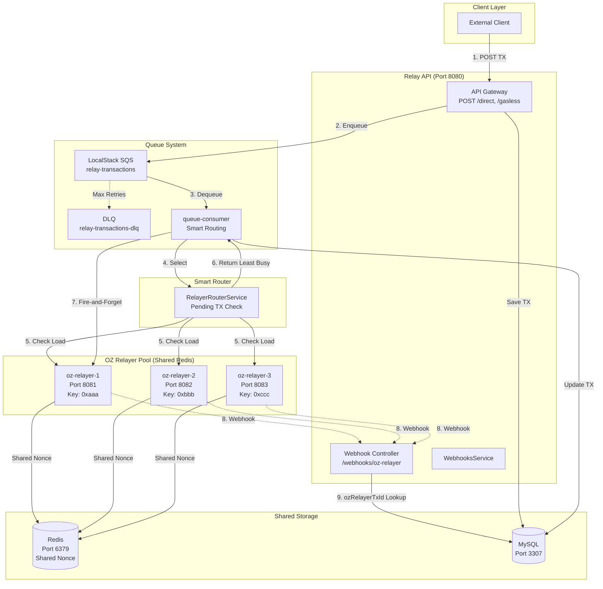
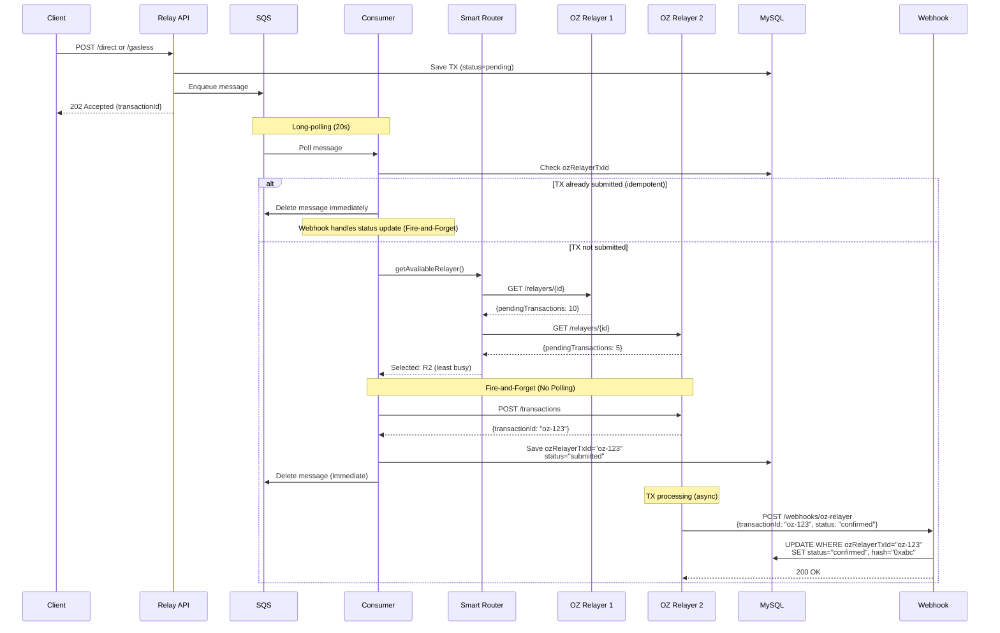

# SPEC-ROUTING-001: Multi Relayer Smart Routing + Fire-and-Forget Pattern

## HISTORY

| Version | Date | Author | Changes |
|---------|------|--------|---------|
| 1.0.0 | 2026-01-08 | MSQ Relayer Team | Initial SPEC creation - Smart Routing, Fire-and-Forget, Webhook Bug Fix |
| 1.1.0 | 2026-01-08 | MSQ Relayer Team | Added DC-004 Hash Field Separation, DC-005 Relayer URL Tracking, Updated FR-004 for Fire-and-Forget pattern |

---

## Overview

Implement intelligent transaction routing across multiple OZ Relayers with fire-and-forget pattern and webhook-based status updates. This SPEC extends the existing SQS queue architecture (SPEC-QUEUE-001) by adding smart routing logic in the Consumer and fixing a critical webhook bug.

**Core Features**:
1. **Multi Relayer Operation**: Utilize existing 3 OZ Relayer instances (SPEC-INFRA-001)
2. **Smart Routing Service**: Intelligent relayer selection based on pending transaction count
3. **Fire-and-Forget Pattern**: Remove blocking confirmation polling, rely on webhooks only
4. **Webhook Bug Fix**: Correct ozRelayerTxId field lookup in WebhooksService

**Architecture Context**:
- Extends: SPEC-QUEUE-001 (SQS Queue System)
- Builds on: SPEC-INFRA-001 (Docker Compose Infrastructure)
- Integrates with: SPEC-WEBHOOK-001 (Webhook System)

---

## System Architecture

### Component Overview



### Transaction Flow (Fire-and-Forget Pattern)



---

## EARS Requirements

### Functional Requirements (FR)

#### FR-001: Smart Routing - Relayer Selection (UBIQUITOUS)

**The system shall**:
- Query all OZ Relayers for pending transaction count via GET `/api/v1/relayers` API
- Select the relayer with the lowest `pending_transactions` count from `response.data.data[0]`
- Fall back to round-robin if health check fails for any relayer
- Skip unhealthy relayers (health check failure or `status === 'paused'`)

**Rationale**: Distribute load evenly across relayers to minimize transaction delay.

---

#### FR-002: Fire-and-Forget Pattern (EVENT-DRIVEN)

**When**: Consumer receives TX message from SQS
**The system shall**:
1. Submit TX to selected OZ Relayer via POST `/transactions`
2. Save `ozRelayerTxId` from response to MySQL `transactions.ozRelayerTxId` field
3. Update TX status to `"submitted"` (not `"confirmed"`)
4. Delete SQS message immediately (no polling)
5. NOT poll OZ Relayer for confirmation

**Unwanted Behavior**:
- Consumer shall NOT call `pollForConfirmation()` after TX submission
- Consumer shall NOT block waiting for TX confirmation

**Rationale**: Reduce SQS message retention time by 95%, improve throughput, rely on webhooks for status updates.

---

#### FR-003: Webhook Bug Fix - ozRelayerTxId Lookup (EVENT-DRIVEN)

**When**: Webhook receives POST `/api/v1/webhooks/oz-relayer` with payload `{transactionId: "oz-123", ...}`
**The system shall**:
1. Query MySQL using `WHERE ozRelayerTxId = "oz-123"` (NOT `WHERE id = "oz-123"`)
2. Update TX status, hash, and confirmedAt
3. Return 404 Not Found if TX not found (invalid webhook)
4. NOT create new TX record (change from `upsert` to `update`)

**Current Bug** (webhooks.service.ts:116):
```typescript
// WRONG: Uses OZ Relayer TX ID as our DB primary key
where: { id: transactionId }  // transactionId is OZ Relayer's ID
```

**Correct Implementation**:
```typescript
// CORRECT: Looks up by ozRelayerTxId field
where: { ozRelayerTxId: transactionId }
```

**Rationale**: OZ Relayer's `transactionId` is NOT our DB primary key. Must use `ozRelayerTxId` field for correct lookup.

---

#### FR-004: Idempotent TX Processing (STATE-DRIVEN)

**When**: Consumer receives duplicate SQS message (at-least-once delivery)
**The system shall**:
1. Check if TX already has `ozRelayerTxId` set in MySQL
2. If `ozRelayerTxId` exists, delete SQS message immediately (do NOT re-submit, no polling)
3. Rely on Webhook for status update (Fire-and-Forget pattern consistent with FR-002)

**Rationale**: Prevent duplicate TX submissions from SQS message retries.

---

#### FR-005: Multi-Environment Configuration (UBIQUITOUS)

**The system shall**:
- Support comma-separated `OZ_RELAYER_URLS` environment variable
- Parse URLs and distribute requests across all configured relayers
- Support environment-specific configuration without code changes

**Example Configurations**:

**Localhost (Docker Compose)**:
```env
OZ_RELAYER_URLS=http://oz-relayer-1:8080,http://oz-relayer-2:8080,http://oz-relayer-3:8080
REDIS_URL=redis://redis:6379
RPC_URL=http://hardhat-node:8545
CHAIN_ID=31337
```

**Amoy Testnet**:
```env
OZ_RELAYER_URLS=https://relayer-1.amoy.example.com,https://relayer-2.amoy.example.com,https://relayer-3.amoy.example.com
REDIS_URL=redis://redis.amoy.example.com:6379
RPC_URL=https://rpc-amoy.polygon.technology
CHAIN_ID=80002
```

**Mainnet**:
```env
OZ_RELAYER_URLS=https://relayer-1.mainnet.example.com,https://relayer-2.mainnet.example.com,https://relayer-3.mainnet.example.com
REDIS_URL=redis://redis.mainnet.example.com:6379
RPC_URL=https://polygon-rpc.com
CHAIN_ID=137
```

---

### Non-Functional Requirements (NFR)

#### NFR-001: Smart Router Performance

**The system shall**:
- Complete relayer selection within 100ms (including pending TX queries)
- Cache relayer health status for 10 seconds to reduce API calls
- Fail fast (skip) if relayer health check takes >500ms

---

#### NFR-002: Fire-and-Forget Efficiency

**The system shall**:
- Reduce SQS message retention time by 95% (from ~60s to ~3s)
- Delete SQS message within 1 second of OZ Relayer response
- Process minimum 10 messages/second with fire-and-forget pattern

---

#### NFR-003: Webhook Processing

**The system shall**:
- Process webhook within 200ms (MySQL update + Redis cache update)
- Handle 100 concurrent webhook requests
- Maintain idempotency (duplicate webhooks safe)

---

### Design Constraints (DC)

#### DC-001: Relayer Private Key Isolation

**The system shall**:
- Use different private keys for each OZ Relayer (prevent nonce collision)
- Share single Redis instance (redis://redis:6379)
- Each relayer maintains independent nonce in Redis by signer address

**Verification**:
```bash
# Check relayer-1.json uses keys/relayer-1/keystore.json
# Check relayer-2.json uses keys/relayer-2/keystore.json
# Check relayer-3.json uses keys/relayer-3/keystore.json
```

---

#### DC-002: Backward Compatibility During Transition

**The system shall**:
- Keep existing `sendDirectTransaction()` and `sendGaslessTransaction()` methods
- Add new `sendDirectTransactionAsync()` and `sendGaslessTransactionAsync()` methods
- Allow gradual migration from polling to fire-and-forget

---

#### DC-003: Docker Compose Infrastructure

**The system shall**:
- Reuse existing oz-relayer-1 service (SPEC-INFRA-001)
- Add oz-relayer-2 and oz-relayer-3 services to docker-compose.yaml
- Configure webhook URLs in relayer-{1,2,3}.json files
- All relayers must connect to shared Redis (redis://redis:6379)

---

#### DC-004: Hash Field Separation (Single Source of Truth)

**The system shall**:
- Consumer ONLY updates `ozRelayerTxId` field (NOT `hash`)
- Webhook ONLY updates `hash`, `status`, and `confirmedAt` fields
- Prevent race condition between Consumer and Webhook

| Component | Sets `ozRelayerTxId` | Sets `hash` | Sets `status` |
|-----------|---------------------|-------------|---------------|
| Consumer | ✅ YES | ❌ NO | `submitted` |
| Webhook | ❌ NO | ✅ YES | `confirmed`/`failed` |

**Rationale**: Fire-and-Forget pattern means Consumer no longer polls, so Webhook is the single source of truth for final transaction hash and status.

---

#### DC-005: Relayer URL Tracking

**The system shall**:
- Store `ozRelayerUrl` field in Transaction table to track which relayer handled TX
- Consumer saves relayer URL when submitting transaction to OZ Relayer

**Schema Addition**:
```prisma
ozRelayerUrl  String?   @map("oz_relayer_url")
```

**Rationale**: Debugging and audit purposes - identify which relayer processed each transaction for load analysis and troubleshooting.

---

## Dependencies

### Prerequisite SPECs

- **SPEC-INFRA-001** (Completed): Docker Compose infrastructure, oz-relayer-1 service
- **SPEC-QUEUE-001** (Completed): SQS queue system, queue-consumer service
- **SPEC-WEBHOOK-001** (Completed): Webhook controller, MySQL transaction storage

### New Package Dependencies

| Package | Version | Purpose |
|---------|---------|---------|
| No new packages | - | Uses existing dependencies |

**Rationale**: All required packages already installed in SPEC-QUEUE-001 and SPEC-WEBHOOK-001.

---

## Quality Gates

- **Test Coverage**: ≥90% (config.json requirement)
- **TRUST 5 Compliance**: Test-first, Readable, Unified, Secured, Trackable
- **EARS Compliance**: All 5 requirement types present (FR, NFR, IF, DC, AC)
- **Breaking Changes**: None (backward compatible)

---

## Traceability

- **TAG**: SPEC-ROUTING-001
- **Related SPECs**:
  - SPEC-QUEUE-001 (SQS Queue System)
  - SPEC-INFRA-001 (Docker Infrastructure)
  - SPEC-WEBHOOK-001 (Webhook System)
- **Git Branch**: `feature/SPEC-ROUTING-001`
- **Task Master Integration**: Task #TBD

---

## Notes

### Redis Sharing Verification

**Question**: Can multiple OZ Relayers share a single Redis instance?
**Answer**: ✅ YES - Each relayer uses a different signer address, so nonce keys are isolated.

**Redis Key Pattern**:
```
relayer:nonce:{signerAddress}  # Different for each relayer
```

**Example**:
- Relayer 1 (0xaaa...): `relayer:nonce:0xaaa`
- Relayer 2 (0xbbb...): `relayer:nonce:0xbbb`
- Relayer 3 (0xccc...): `relayer:nonce:0xccc`

### OZ Relayer API Reference

**Get Relayer Info** (for pending TX count):
```http
GET /relayers/{id}
Authorization: Bearer {API_KEY}

Response:
{
  "relayerId": "relayer-1",
  "numberOfPendingTransactions": 5,
  "paused": false
}
```

**Send Transaction** (fire-and-forget):
```http
POST /transactions
Authorization: Bearer {API_KEY}
Content-Type: application/json

{
  "to": "0x...",
  "data": "0x...",
  "value": "0",
  "gasLimit": "100000"
}

Response:
{
  "transactionId": "oz-123",  // OZ Relayer's internal TX ID
  "status": "pending"
}
```

**Webhook Payload** (from OZ Relayer):
```http
POST /api/v1/webhooks/oz-relayer
X-OZ-Signature: {HMAC-SHA256}

{
  "transactionId": "oz-123",  // Same as ozRelayerTxId in our DB
  "hash": "0xabc...",
  "status": "confirmed",
  "from": "0x...",
  "to": "0x...",
  "createdAt": "2026-01-08T10:00:00Z",
  "confirmedAt": "2026-01-08T10:01:00Z"
}
```

---

## Completion Checklist

- [ ] oz-relayer-2 and oz-relayer-3 added to docker-compose.yaml
- [ ] Webhook URLs configured in relayer-{1,2,3}.json
- [ ] RelayerRouterService implemented with pending TX check
- [ ] Fire-and-forget methods (sendDirectTransactionAsync, sendGaslessTransactionAsync) added
- [ ] Webhook bug fixed (ozRelayerTxId lookup)
- [ ] Consumer.service.ts updated to use fire-and-forget
- [ ] Hash field separation enforced (Consumer: ozRelayerTxId only, Webhook: hash only)
- [ ] ozRelayerUrl field added to schema and Consumer saves relayer URL
- [ ] Unit tests ≥90% coverage
- [ ] E2E tests validate smart routing and fire-and-forget
- [ ] Multi-environment configuration tested (localhost, Amoy config examples)
- [ ] All EARS requirements satisfied

---

**Version**: 1.1.0
**Status**: Draft
**Last Updated**: 2026-01-08
