# Queue System Architecture

**Document Version**: 1.0.0
**Last Updated**: 2026-01-06
**Status**: Complete
**SPEC**: [SPEC-QUEUE-001](./../.moai/specs/SPEC-QUEUE-001/spec.md)

## Table of Contents

1. [Overview](#overview)
2. [Architecture Layers](#architecture-layers)
3. [Message Flow](#message-flow)
4. [Component Responsibilities](#component-responsibilities)
5. [Data Models](#data-models)
6. [Resilience Patterns](#resilience-patterns)
7. [Deployment Topology](#deployment-topology)

---

## Overview

SPEC-QUEUE-001 transforms the MSQ Relayer from a synchronous request-response system to an asynchronous, scalable queue-based architecture using AWS SQS (with LocalStack for local development).

### Key Architectural Changes

**Before (Synchronous)**:
- Client sends transaction request → API waits for response → OZ Relayer processes synchronously
- Throughput limited by response time (~200ms)
- Tight coupling between API Gateway and OZ Relayer

**After (Asynchronous)**:
- Client sends transaction request → API returns 202 Accepted immediately
- Transaction queued in SQS for background processing
- Decoupled producer (relay-api) and consumer (queue-consumer)
- Independent scaling for API and background workers

### Architecture Principles

1. **Decoupling**: Producer and Consumer are independent services
2. **Resilience**: SQS provides built-in retry and dead letter queue mechanisms
3. **Scalability**: Horizontal scaling by adding consumer instances
4. **Observability**: Transaction status tracked at each stage
5. **Idempotency**: Duplicate message handling via transaction status checks

---

## Architecture Layers

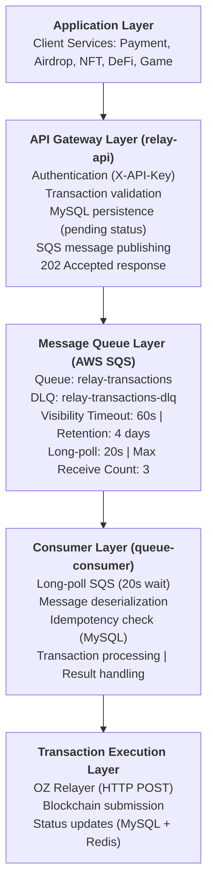

### Layer Responsibilities

| Layer | Component | Responsibility |
|-------|-----------|---|
| **API Gateway** | relay-api | Accept requests, store pending TX, publish to SQS |
| **Message Queue** | AWS SQS | Reliable message delivery, retry handling, DLQ |
| **Consumer** | queue-consumer | Long-poll SQS, orchestrate OZ Relayer calls |
| **Execution** | OZ Relayer | Sign and submit transactions to blockchain |
| **Storage** | MySQL + Redis | Transaction history and caching |

---

## Message Flow

### 1. Producer Flow (relay-api)

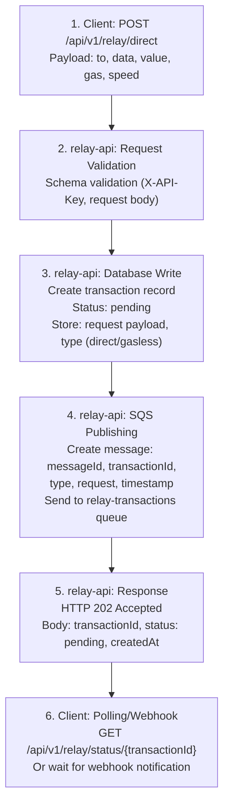

### 2. Queue Flow (AWS SQS)

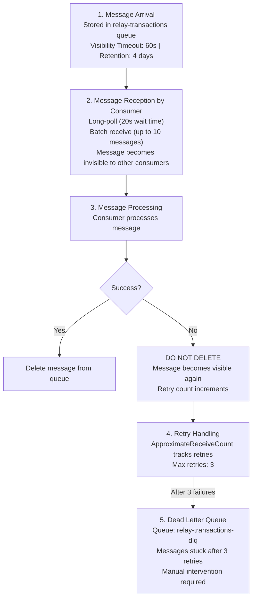

### 3. Consumer Flow (queue-consumer)

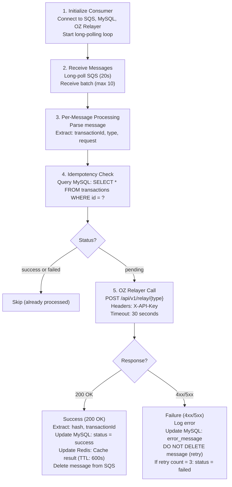

### 4. Status Query Flow

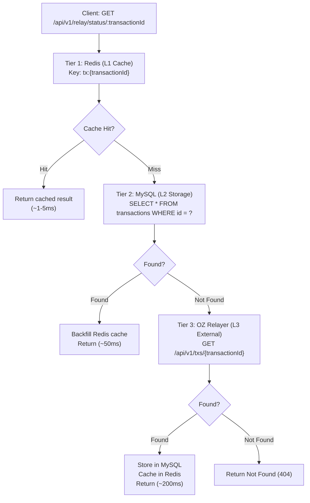

---

## Component Responsibilities

### relay-api (Producer)

**Responsibilities**:
- Accept transaction requests from clients
- Validate request schema and authentication
- Store transaction record in MySQL with `pending` status
- Publish message to SQS queue
- Return 202 Accepted response immediately
- Provide status query endpoint (3-tier lookup)

**Key Modules**:
- `relay/direct.controller.ts` - Direct TX endpoint
- `relay/gasless.controller.ts` - Gasless TX endpoint
- `relay/status.controller.ts` - Status query endpoint
- `queue/queue.service.ts` - SQS publishing
- `prisma/prisma.service.ts` - MySQL persistence

### queue-consumer (Consumer)

**Responsibilities**:
- Connect to SQS queue
- Long-poll messages (20s wait time)
- Deserialize message payload
- Check transaction status (idempotency)
- Submit transaction to OZ Relayer
- Update transaction status in MySQL
- Handle failures and DLQ
- Graceful shutdown

**Key Modules**:
- `consumer.service.ts` - Main consumer logic
- `sqs/sqs.adapter.ts` - SQS client wrapper
- `relay/oz-relayer.client.ts` - OZ Relayer HTTP client
- `config/configuration.ts` - Environment configuration

### AWS SQS

**Responsibilities**:
- Store transaction messages durably
- Guarantee message delivery (at-least-once)
- Automatic retry via visibility timeout
- Dead Letter Queue for failed messages
- Message retention for audit trail

**Configuration**:
- Queue Name: `relay-transactions`
- DLQ Name: `relay-transactions-dlq`
- Visibility Timeout: 60 seconds
- Message Retention: 4 days
- Long-poll Wait Time: 20 seconds
- Max Receive Count: 3

---

## Data Models

### SQS Message Format

```json
{
  "messageId": "550e8400-e29b-41d4-a716-446655440000",
  "transactionId": "550e8400-e29b-41d4-a716-446655440001",
  "type": "direct|gasless",
  "request": {
    "to": "0x5FbDB2315678afecb367f032d93F642f64180aa3",
    "data": "0x",
    "value": "0",
    "gas": "21000",
    "speed": "fast"
  },
  "timestamp": "2026-01-06T12:34:56.789Z"
}
```

### MySQL Transaction Record

```sql
CREATE TABLE transactions (
  id VARCHAR(36) PRIMARY KEY,
  type VARCHAR(20),                      -- 'direct' | 'gasless'
  status VARCHAR(20),                    -- 'pending' | 'success' | 'failed'
  request JSON,                          -- Original request payload
  result JSON,                           -- OZ Relayer response (hash, transactionId)
  error_message TEXT,                    -- Failure reason
  hash VARCHAR(66),                      -- Blockchain transaction hash
  createdAt DATETIME,
  confirmedAt DATETIME,
  updatedAt DATETIME,

  INDEX(status),
  INDEX(type),
  INDEX(createdAt)
);
```

### Redis Cache Format

```
Key: tx:{transactionId}
Value: {
  "transactionId": "UUID",
  "status": "success|pending|failed",
  "hash": "0x...",
  "confirmedAt": "ISO8601",
  "result": { ... }
}
TTL: 600 seconds (10 minutes)
```

---

## Resilience Patterns

### 1. Message Durability

**Pattern**: At-Least-Once Delivery

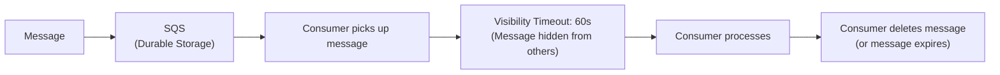

**Implication**: Consumer MUST be idempotent

### 2. Idempotency

**Pattern**: Idempotent Message Processing

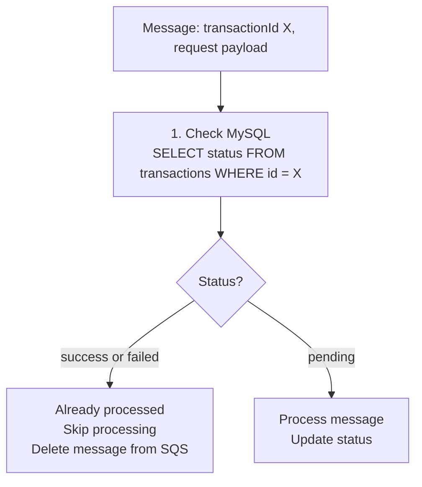

### 3. Retry Strategy

**Pattern**: Exponential Backoff via Visibility Timeout

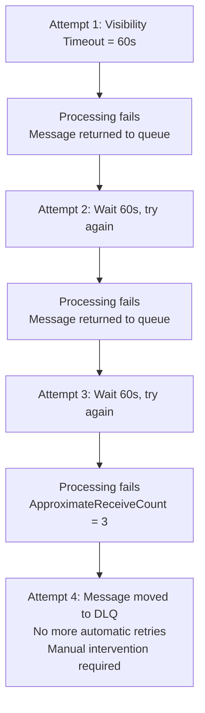

### 4. Dead Letter Queue

**Pattern**: Failure Isolation

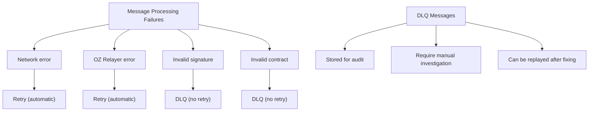

### 5. Circuit Breaker (Optional)

**Pattern**: Prevent Cascading Failures

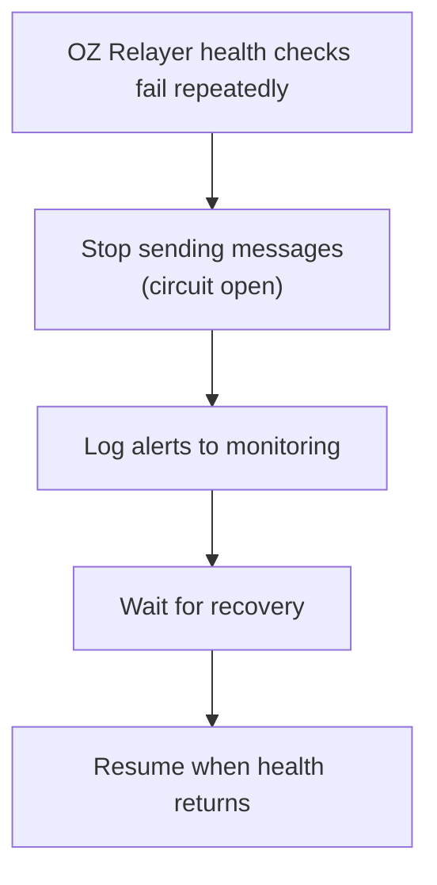

---

## Deployment Topology

### Local Development (Docker)

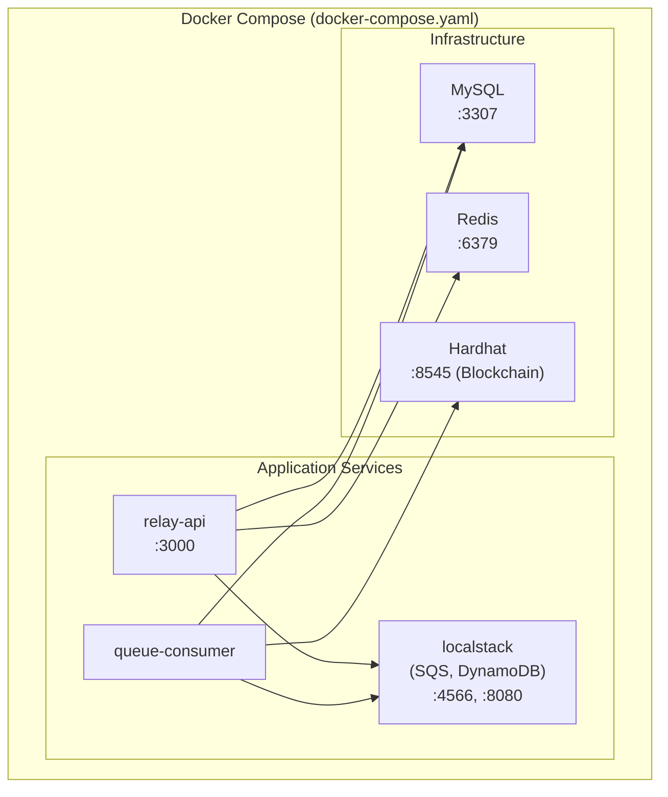

### Production (AWS ECS/EKS)

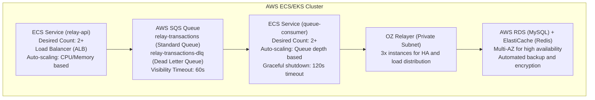

### Scaling Considerations

**relay-api (Producer)**:
- Scales based on request rate
- Lightweight operation (save to DB + SQS publish)
- Auto-scaling: 2-10 instances based on CPU/request count

**queue-consumer (Consumer)**:
- Scales based on queue depth
- Can process ~10-100 messages/sec per instance
- Auto-scaling: 1-20 instances based on SQS queue depth
- CloudWatch metric: ApproximateNumberOfMessagesVisible

**SQS Queue**:
- Unlimited throughput (AWS manages)
- Message retention: 4 days
- Cost: Pay per million requests

**OZ Relayer**:
- Fixed pool (3 instances for HA)
- Load balancing via Nginx
- Health checks every 30 seconds

---

## Monitoring & Observability

### Key Metrics

| Metric | Source | Alert Threshold |
|--------|--------|---|
| SQS Queue Depth | CloudWatch | > 1000 messages |
| Consumer Lag | CloudWatch | > 5 minutes |
| Message Processing Time | App Logs | > 10 seconds |
| DLQ Message Count | CloudWatch | > 10 messages |
| OZ Relayer Error Rate | App Logs | > 5% |
| Transaction Status - Pending | MySQL | > 1 hour |

### Logging Strategy

```
Consumer Log Format:
{
  "timestamp": "ISO8601",
  "level": "info|warn|error",
  "transactionId": "UUID",
  "messageId": "UUID",
  "action": "message_received|processing|success|failure",
  "duration_ms": 1234,
  "error": "error description (if any)",
  "oz_relayer_response": {...}
}
```

---

## Summary

SPEC-QUEUE-001 implements a robust, scalable async queue-based architecture that:

1. ✅ Decouples producer and consumer
2. ✅ Provides at-least-once message delivery
3. ✅ Ensures idempotent message processing
4. ✅ Enables independent scaling
5. ✅ Improves response time (202 vs 200 with hash)
6. ✅ Handles failures gracefully (DLQ)
7. ✅ Maintains audit trail (MySQL history)
8. ✅ Optimizes for local development (LocalStack)

See [SPEC-QUEUE-001](./../.moai/specs/SPEC-QUEUE-001/spec.md) for complete technical specifications.
