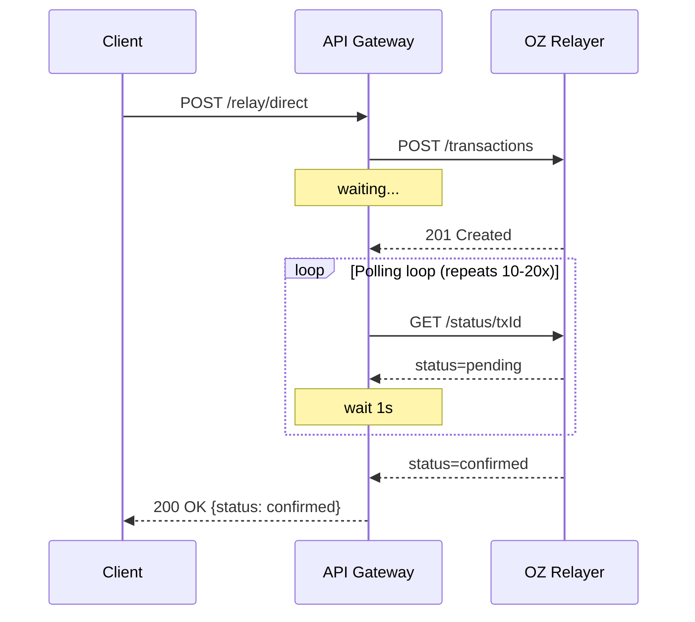
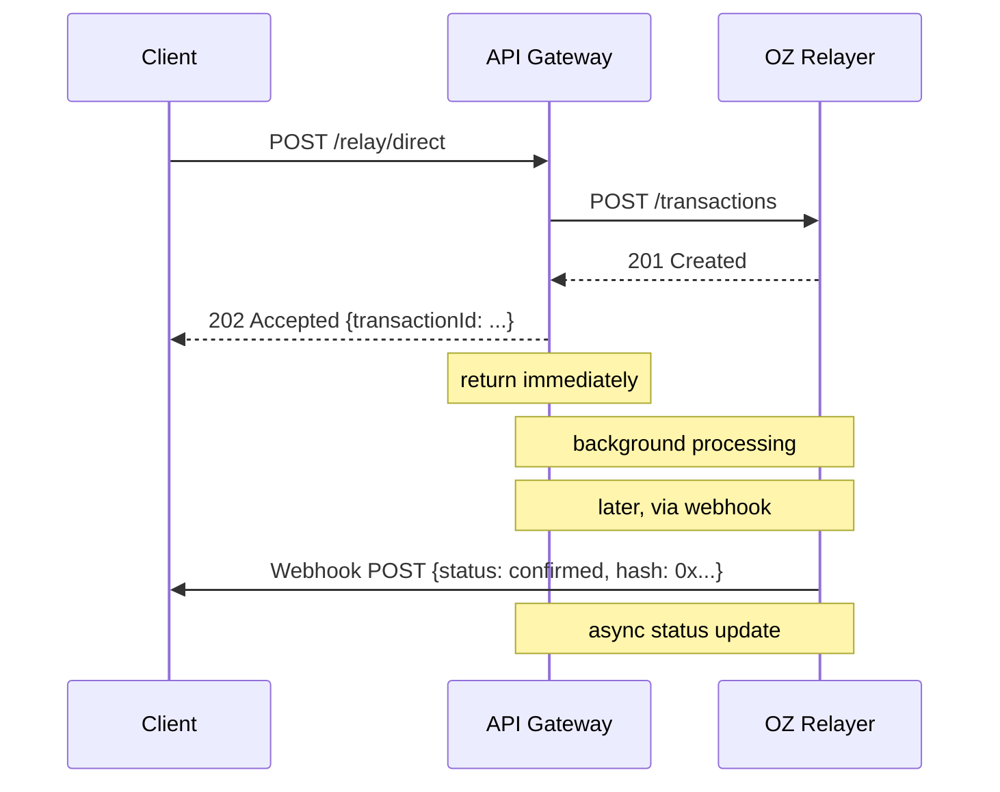
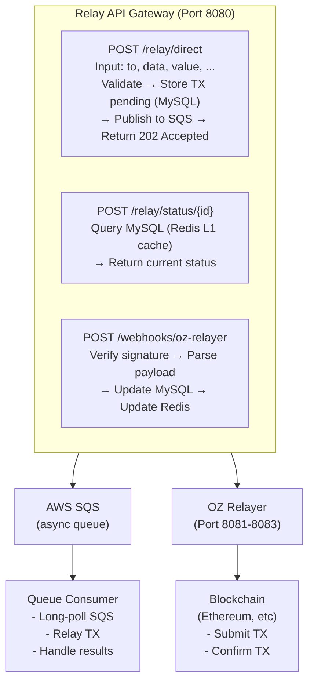
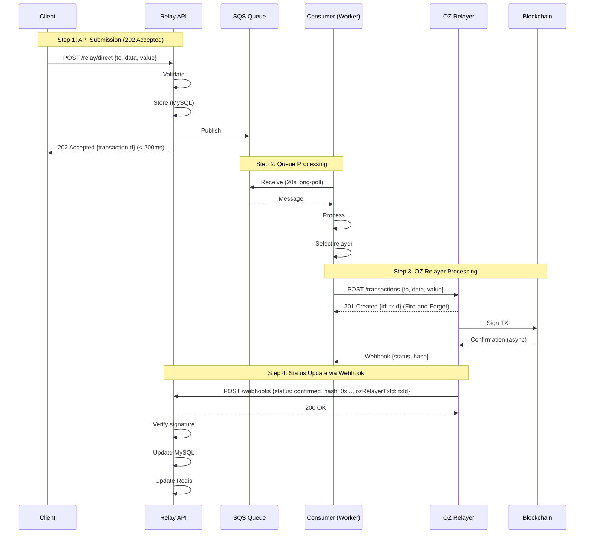
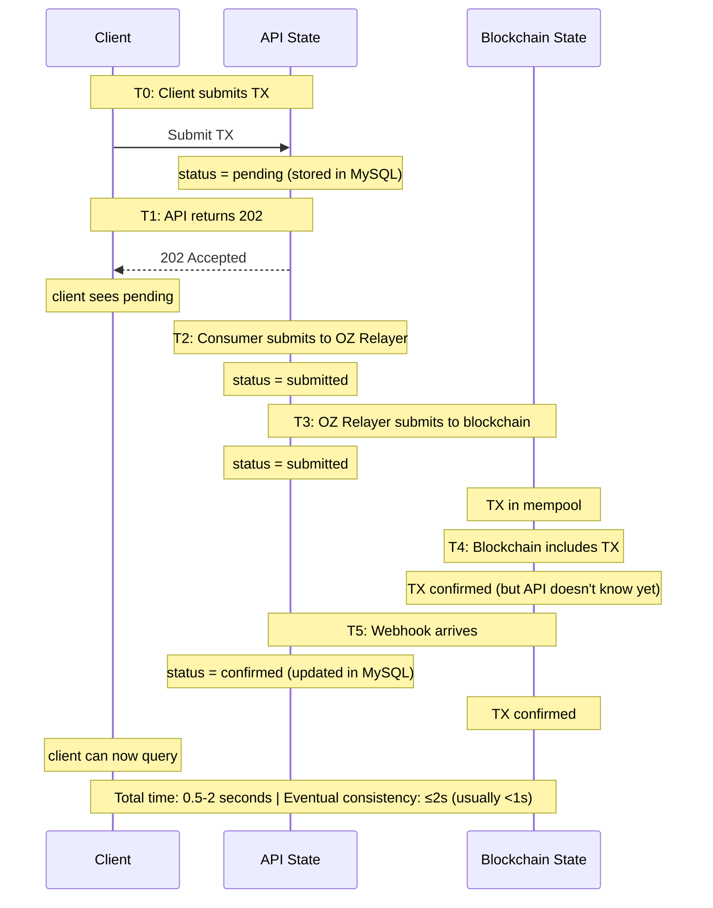
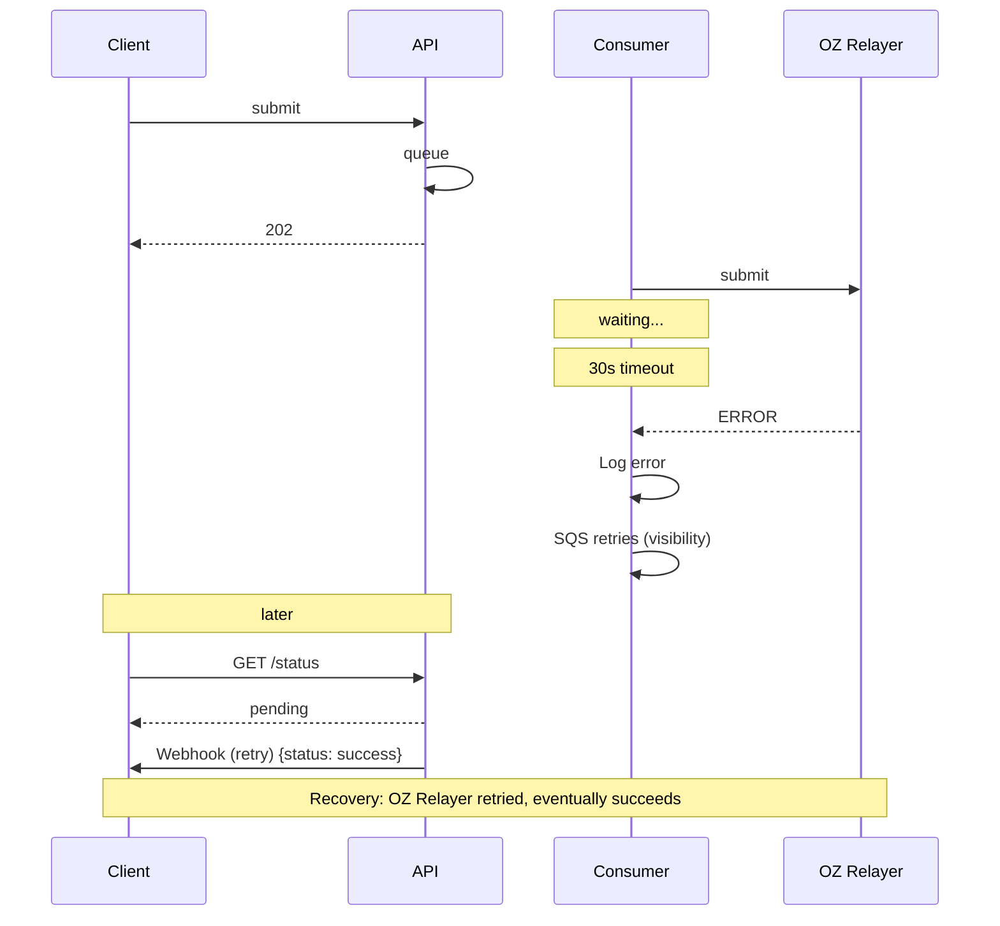
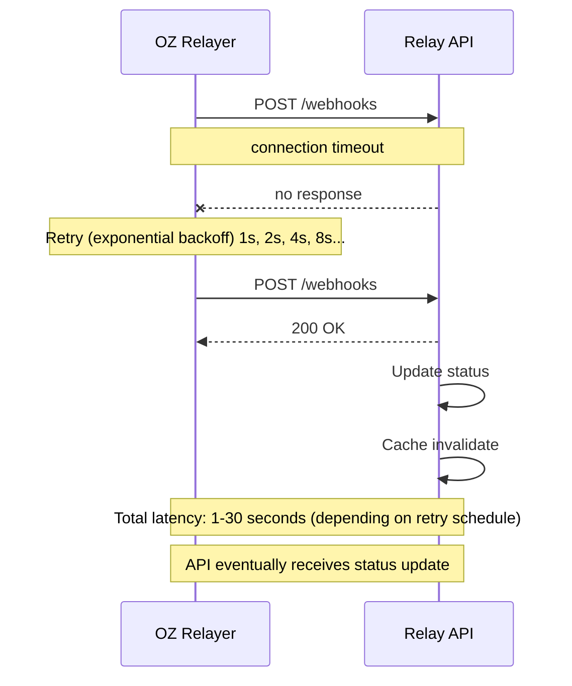
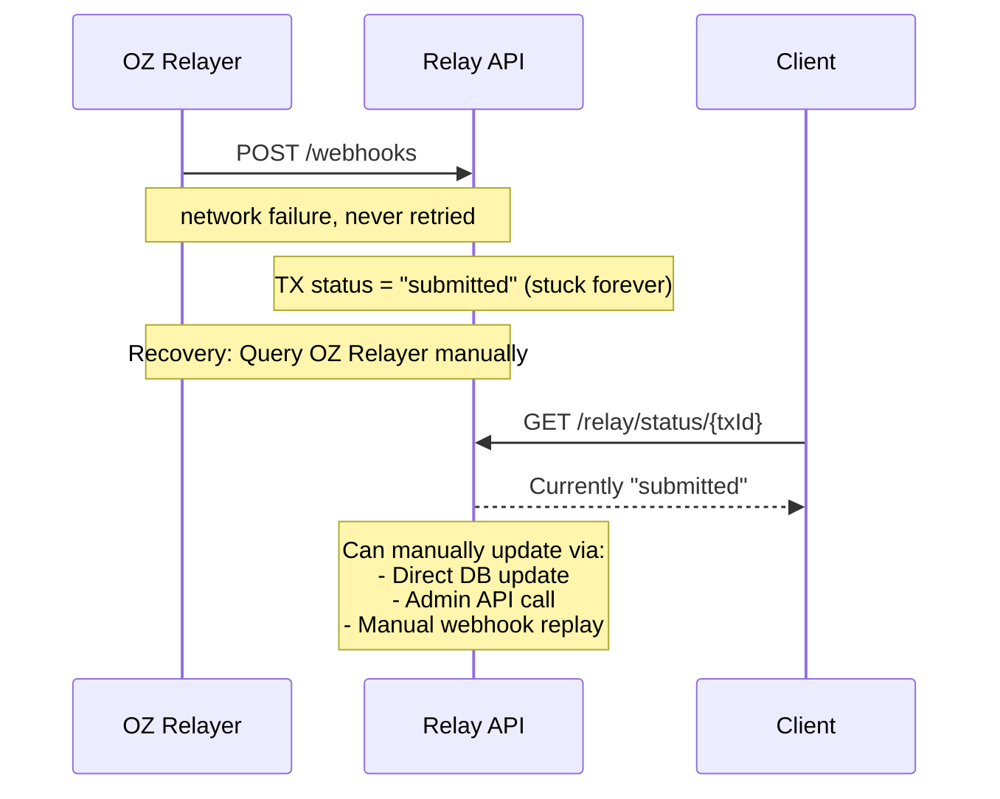
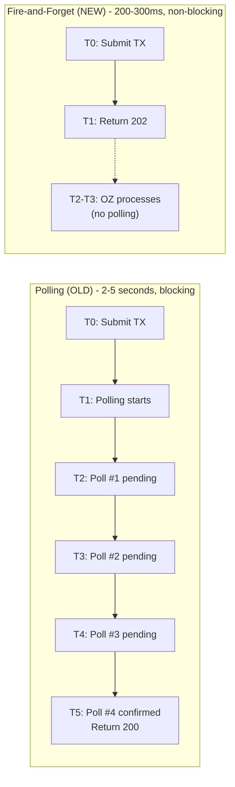
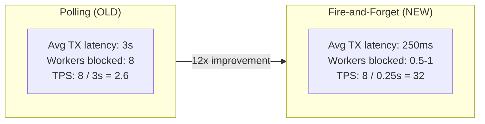

# Fire-and-Forget Pattern Guide

**Document Version**: 1.0.0
**Last Updated**: 2026-01-09
**Status**: Active
**SPEC**: [SPEC-ROUTING-001](./../.moai/specs/SPEC-ROUTING-001/spec.md)

## Table of Contents

1. [Overview](#overview)
2. [Concept](#concept)
3. [Architecture](#architecture)
4. [Implementation](#implementation)
5. [Webhook-Based Updates](#webhook-based-updates)
6. [Idempotency & Guarantees](#idempotency--guarantees)
7. [Error Scenarios](#error-scenarios)
8. [Comparison: Fire-and-Forget vs. Polling](#comparison-fire-and-forget-vs-polling)
9. [Best Practices](#best-practices)
10. [Troubleshooting](#troubleshooting)

---

## Overview

The Fire-and-Forget pattern is a core optimization in SPEC-ROUTING-001 that enables asynchronous, non-blocking transaction submission. Instead of waiting for blockchain confirmation, the API returns immediately after sending the transaction to OZ Relayer, and status updates are delivered via webhook callbacks.

### Key Benefits

- **Faster API Response**: 200-300ms instead of 2-5 seconds
- **Higher Throughput**: Process more transactions per second
- **Better User Experience**: Immediate acknowledgment of submission
- **Reduced Coupling**: API doesn't depend on relayer's confirmation time
- **Scalability**: Easier to scale with long-running transactions

### Trade-offs

- **Eventual Consistency**: Status not immediately available in response
- **Webhook Dependency**: Must implement webhook to receive updates
- **Network Complexity**: Requires bidirectional communication
- **Error Recovery**: More complex error scenarios to handle

---

## Concept

### Traditional Polling Approach (Before)



**Issues**:
- Total latency: 2-5 seconds (blocking)
- Multiple HTTP requests to relayer
- API server holds connection during polling
- Limited concurrent transactions

### Fire-and-Forget Approach (After)



**Improvements**:
- Total latency: 200-300ms (non-blocking)
- Single HTTP request to relayer
- API server free for other requests
- Higher concurrent transaction limit

---

## Architecture

### Components



### Flow Diagram (Detailed)



---

## Implementation

### sendDirectTransactionAsync Method

**File**: `packages/queue-consumer/src/relay/oz-relayer.client.ts`

```typescript
/**
 * SPEC-ROUTING-001 FR-002: Fire-and-Forget Direct Transaction
 *
 * Sends transaction to OZ Relayer and returns immediately after submission.
 * No polling - Webhook handles status updates.
 *
 * @param request - Direct transaction request
 * @param relayerUrl - Target relayer URL (from Smart Routing)
 * @returns OZ Relayer's transaction ID (for tracking)
 */
async sendDirectTransactionAsync(
  request: {
    to: string;
    data: string;
    value?: string;
    gasLimit?: string;
    speed?: string;
  },
  relayerUrl: string,
): Promise<{ transactionId: string; relayerUrl: string }> {
  try {
    // Get relayer ID from the specific relayer
    const relayerId = await this.getRelayerIdFromUrl(relayerUrl);
    const endpoint = `${relayerUrl}/api/v1/relayers/${relayerId}/transactions`;

    this.logger.debug(`[Fire-and-Forget] Sending direct TX to: ${endpoint}`);

    const ozRequest = {
      to: request.to,
      data: request.data,
      value: request.value ? parseInt(request.value, 10) : 0,
      gas_limit: request.gasLimit ? parseInt(request.gasLimit, 10) : 100000,
      speed: request.speed || 'average',
    };

    const response = await axios.post(endpoint, ozRequest, {
      headers: {
        'Content-Type': 'application/json',
        Authorization: `Bearer ${this.apiKey}`,
      },
      timeout: 30000,
    });

    const txData = response.data.data;
    const ozTxId = txData.id;

    this.logger.log(
      `[Fire-and-Forget] Direct TX submitted: ${ozTxId} (no polling)`,
    );

    // FR-002: Return immediately, no polling
    return {
      transactionId: ozTxId,
      relayerUrl,
    };
  } catch (error) {
    if (axios.isAxiosError(error)) {
      this.invalidateRelayerIdCache(error);
    }
    throw error;
  }
}
```

### sendGaslessTransactionAsync Method

```typescript
/**
 * SPEC-ROUTING-001 FR-002: Fire-and-Forget Gasless Transaction
 *
 * Sends gasless transaction via Forwarder.execute() and returns immediately.
 * No polling - Webhook handles status updates.
 *
 * @param request - Gasless transaction request
 * @param forwarderAddress - ERC2771Forwarder contract address
 * @returns OZ Relayer's transaction ID (for tracking)
 */
async sendGaslessTransactionAsync(
  request: {
    request: {
      from: string;
      to: string;
      value: string;
      data: string;
      nonce: number;
      gas: number;
      deadline: number;
    };
    signature: string;
  },
  forwarderAddress: string,
): Promise<{ transactionId: string; relayerUrl: string }> {
  // Similar to sendDirectTransactionAsync
  // Returns immediately after OZ Relayer accepts submission
}
```

### Consumer Integration

**File**: `packages/queue-consumer/src/consumer.service.ts`

```typescript
async processQueueMessage(message: QueueMessage) {
  const { transactionId, clientId, txData } = message;

  try {
    // Step 1: Select best relayer (Smart Routing)
    const relayerUrl = await this.relayerRouter.getAvailableRelayer();
    this.logger.log(`Selected relayer: ${relayerUrl}`);

    // Step 2: Send transaction (Fire-and-Forget)
    const result = await this.ozRelayerClient.sendDirectTransactionAsync(
      txData,
      relayerUrl,
    );

    // Step 3: Store OZ Relayer TX ID for webhook matching
    await this.repository.updateTransaction(transactionId, {
      ozRelayerTxId: result.transactionId,
      relayerUrl: relayerUrl,
      status: 'submitted', // Waiting for webhook confirmation
    });

    // Step 4: Delete message from queue (fire-and-forget complete)
    await this.sqsAdapter.deleteMessage(message.receiptHandle);

    this.logger.log(
      `[Fire-and-Forget] TX ${transactionId} submitted to ${relayerUrl}`,
    );
  } catch (error) {
    this.logger.error(`[Fire-and-Forget] Failed to submit TX ${transactionId}:`, error);
    // Message will be retried by SQS (visibility timeout)
    // Eventually sent to DLQ if max retries exceeded
  }
}
```

---

## Webhook-Based Updates

### Webhook Receiver

**File**: `packages/relay-api/src/webhooks/webhooks.controller.ts`

```typescript
@Controller('webhooks')
export class WebhooksController {
  /**
   * POST /webhooks/oz-relayer
   * Receive transaction status updates from OZ Relayer
   */
  @Post('oz-relayer')
  @UseGuards(WebhookSignatureGuard)
  async handleOzRelayerWebhook(
    @Body() payload: OzRelayerWebhookDto,
  ): Promise<void> {
    const { ozRelayerTxId, status, hash, oz_relayer_url } = payload;

    this.logger.log(
      `Received webhook: TX ${ozRelayerTxId} → ${status}`,
    );

    // Find transaction by OZ Relayer TX ID
    const transaction = await this.repository.findByOzRelayerTxId(
      ozRelayerTxId,
    );

    if (!transaction) {
      this.logger.warn(`TX not found: ${ozRelayerTxId}`);
      return; // Idempotent: ignore unknown TX
    }

    // Update transaction status
    await this.repository.updateTransaction(transaction.id, {
      status: status,
      hash: hash,
      confirmedAt: new Date(),
      oz_relayer_url: oz_relayer_url,
    });

    // Invalidate Redis cache
    await this.cache.invalidate(`tx:${transaction.id}`);

    this.logger.log(`Updated TX ${transaction.id} → ${status}`);
  }
}
```

### Webhook Payload

OZ Relayer sends webhook with following structure:

```json
{
  "event": "transaction_confirmed",
  "ozRelayerTxId": "550e8400-e29b-41d4-a716-446655440000",
  "status": "confirmed",
  "hash": "0x1234567890abcdef1234567890abcdef1234567890abcdef1234567890abcdef",
  "oz_relayer_url": "http://oz-relayer-0:8080",
  "blockNumber": 12345678,
  "gasUsed": "21000",
  "timestamp": "2026-01-09T10:30:45.123Z",
  "signature": "0x..."
}
```

### Signature Verification

**File**: `packages/relay-api/src/webhooks/guards/webhook-signature.guard.ts`

```typescript
@Injectable()
export class WebhookSignatureGuard implements CanActivate {
  canActivate(context: ExecutionContext): boolean {
    const request = context.switchToHttp().getRequest();
    const signature = request.headers['x-oz-signature'];
    const rawBody = request.rawBody as Buffer; // Raw request body

    // SPEC-ROUTING-001: Use raw body for HMAC calculation
    // JSON.stringify is insecure - it may produce different bytes than original
    // Raw body preserves exact bytes sent by OZ Relayer
    const expectedSignature = crypto
      .createHmac('sha256', this.webhookSecret)
      .update(rawBody)
      .digest('base64');

    if (signature !== expectedSignature) {
      throw new UnauthorizedException('Invalid webhook signature');
    }

    return true;
  }
}
```

---

## Idempotency & Guarantees

### Idempotent Processing

The system is idempotent at multiple levels:

#### Level 1: Transaction ID Uniqueness

```typescript
// Client generates unique transactionId
// If same transactionId resubmitted:
// → API returns existing transaction (202 Accepted, cached)
// → No duplicate submission to OZ Relayer
```

#### Level 2: Webhook Idempotency

```typescript
// If webhook is received multiple times:
// → Find TX by ozRelayerTxId (unique)
// → Update status (idempotent operation)
// → Return 200 OK regardless

// Example: Same webhook received 3 times
1. First: status pending → pending (no change)
2. Second: status confirmed (update)
3. Third: status confirmed → confirmed (no change)

// Final result: status = confirmed (idempotent)
```

#### Level 3: SQS Message Idempotency

```typescript
// Each SQS message has unique:
// - MessageId (generated by SQS)
// - ReceiptHandle (for deletion)
//
// If consumer processes same message twice:
// → Check if TX already exists in database
// → Deduplicate by transactionId
// → No duplicate OZ Relayer submission
```

### Delivery Guarantees

| Guarantee | Implementation | Consequence |
|-----------|----------------|------------|
| **At-Least-Once** | SQS retry + visibility timeout | Consumer may process same TX twice |
| **Idempotent Submission** | transactionId uniqueness | Safe to retry without duplication |
| **Eventual Consistency** | Webhook updates status | Status eventually consistent with blockchain |
| **No Data Loss** | DLQ for failed messages | Failed TXs tracked in dead-letter queue |

### Consistency Model



---

## Error Scenarios

### Scenario 1: OZ Relayer Timeout



### Scenario 2: Webhook Delivery Failure



### Scenario 3: Webhook Lost (Permanent)



---

## Comparison: Fire-and-Forget vs. Polling

### Response Time



**Improvement: 10x faster**

### Throughput



**Single API Server (8 workers) -- Improvement: 12x more transactions/second**

### Complexity

| Aspect | Polling | Fire-and-Forget |
|--------|---------|-----------------|
| API Response | Simple (wait for result) | Simple (202 Accepted) |
| Status Tracking | Polling loop | Webhook receiver |
| Error Handling | Retry polling | Webhook + manual recovery |
| Idempotency | Medium | High (required) |
| Testing | Easier | Requires async testing |

### Recommendation

**Use Fire-and-Forget when**:
- ✓ High throughput needed (>10 TPS)
- ✓ Can implement webhook receiver
- ✓ Eventual consistency acceptable
- ✓ Building asynchronous workflows

**Use Polling when**:
- ✓ Low throughput (<1 TPS)
- ✓ Simple synchronous integration
- ✓ No webhook infrastructure
- ✓ Real-time response required

---

## Best Practices

1. **Generate Unique Transaction IDs**
   ```typescript
   const txId = uuid.v4(); // Globally unique
   // Always use same txId for same transaction
   ```

2. **Implement Webhook Receiver**
   ```typescript
   // Required for fire-and-forget
   POST /webhooks/oz-relayer (with signature verification)
   Update database with {status, hash, timestamp}
   ```

3. **Store oz_relayer_url for Debugging**
   ```typescript
   // Link transaction to specific relayer
   tx.oz_relayer_url = "http://oz-relayer-0:8080"
   // Helps debugging and relayer-specific issues
   ```

4. **Verify Webhook Signatures**
   ```typescript
   // Always verify HMAC-SHA256 signature
   // Prevents replay attacks
   // Ensures webhook authenticity
   ```

5. **Handle Eventual Consistency**
   ```typescript
   // Status may not be available immediately after 202
   // Implement polling on client side with backoff
   // Or subscribe to webhook updates
   ```

6. **Monitor Webhook Delivery**
   ```typescript
   // Track webhook success/failure rate
   // Alert if >1% webhook failures
   // Implement retry logic with exponential backoff
   ```

7. **Implement Timeout Handling**
   ```typescript
   // Set maximum time waiting for webhook
   // Example: 5 minutes
   // After timeout, mark as "webhook_timeout"
   // Trigger manual recovery process
   ```

---

## Troubleshooting

### Issue: Transaction Stuck in "Submitted" Status

**Symptoms**: TX submitted but webhook never arrives

**Diagnosis**:
```bash
# Check OZ Relayer logs
docker logs oz-relayer-0

# Check if webhook endpoint is reachable
curl -X POST http://relay-api:8080/api/v1/webhooks/oz-relayer \
  -H "Content-Type: application/json" \
  -d '{"test": true}'

# Check firewall rules
iptables -L -n | grep 8080
```

**Solutions**:
1. Verify webhook endpoint is accessible from OZ Relayer
2. Check webhook secret configuration match
3. Verify network connectivity between services
4. Check relay-api service is running

### Issue: Webhook Signature Verification Failed

**Symptoms**: 401 Unauthorized on webhook POST

**Diagnosis**:
```bash
# Check webhook secret
echo $WEBHOOK_SECRET

# Verify signature calculation
# 1. Get raw webhook payload (without modification)
# 2. Calculate HMAC-SHA256
# 3. Compare with header signature
```

**Solutions**:
1. Verify WEBHOOK_SECRET matches in both services
2. Use raw body (not parsed JSON)
3. Exclude signature field from hash
4. Check HMAC algorithm (must be SHA256)

### Issue: Duplicate Webhook Deliveries

**Symptoms**: TX status updated multiple times, idempotency fails

**Diagnosis**:
```bash
# Check transaction update log
SELECT * FROM transactions
WHERE oz_relayer_tx_id = 'txId'
ORDER BY updated_at;

# Should show multiple updates with same final status
```

**Solutions**:
1. Idempotency is working correctly
2. Multiple webhooks expected (OZ Relayer retries)
3. Verify final status is correct
4. Monitor webhook delivery reliability

---

## Related Documents

- [SMART_ROUTING_GUIDE.md](./SMART_ROUTING_GUIDE.md) - Smart Routing component
- [QUEUE_INTEGRATION.md](./QUEUE_INTEGRATION.md) - Queue system overview
- [WEBHOOK_INTEGRATION.md](./WEBHOOK_INTEGRATION.md) - Webhook security & setup
- [SPEC-ROUTING-001](./../.moai/specs/SPEC-ROUTING-001/spec.md) - Specification

---

**Maintained by**: MSQ Relayer Team
**Last Reviewed**: 2026-01-09
**Status**: Active & Production-Ready
