# MSQ Relayer Service - Architecture & Flow Diagrams

**Version**: 1.0
**Last Updated**: 2025-12-19
**Status**: Phase 1 Complete

Visual diagrams for understanding MSQ Relayer Service architecture, transaction flows, and component interactions.

---

## Table of Contents

1. [System Architecture](#system-architecture)
2. [Direct Transaction Flow](#direct-transaction-flow)
3. [Gasless Transaction Flow](#gasless-transaction-flow)
4. [Multi-Relayer Pool](#multi-relayer-pool)
5. [Health Check System](#health-check-system)
6. [Deployment Architecture](#deployment-architecture)

---

## System Architecture

### High-Level System Overview

```mermaid
flowchart TB
    subgraph Clients["🔵 Client Services (B2B)"]
        Payment["💰 Payment System"]
        Airdrop["🎁 Airdrop System"]
        NFTService["🖼️ NFT Service"]
        DeFi["📊 DeFi/Game Service"]
    end

    subgraph Gateway["🟢 NestJS API Gateway"]
        Auth["🔐 Auth\n(API Key)"]
        QueueAdapter["📦 Queue\nAdapter"]
        Policy["⚖️ Policy\nEngine"]
        GaslessCoord["⚡ Gasless\nCoordinator"]
        APIDocs["📖 API Docs\n(Swagger)"]
    end

    subgraph OZServices["🟠 OZ Open Source Services"]
        Relayer["🚀 OZ Relayer v1.3.0\n(Rust/Docker)"]
        Monitor["📡 OZ Monitor v1.1.0\n(Rust/Docker)"]
    end

    subgraph SmartContracts["📝 Smart Contracts"]
        Forwarder["🔀 ERC2771\nForwarder"]
        Target["🎯 Target Contracts\n(ERC20, ERC721)"]
    end

    subgraph Infra["🟣 Infrastructure"]
        Redis["💾 Redis\n(Queue)"]
        Prometheus["📊 Prometheus\n+ Grafana"]
    end

    subgraph Blockchain["⛓️ Blockchain Networks"]
        Polygon["🔷 Polygon\n(P0)"]
        Ethereum["⚪ Ethereum\n(P1)"]
        BNB["🟡 BNB Chain\n(P2)"]
    end

    Clients --> Gateway
    Gateway --> OZServices
    Relayer --> SmartContracts
    SmartContracts --> Blockchain
    OZServices --> Infra
    Gateway --> Infra
    Monitor --> Blockchain
```



---

## Direct Transaction Flow

### Direct TX Sequence Diagram

```mermaid
sequenceDiagram
    autonumber
    participant Client as "💰 Client\nService"
    participant Gateway as "🟢 API\nGateway"
    participant Relayer as "🚀 OZ\nRelayer"
    participant BC as "⛓️ Blockchain"

    Client->>Gateway: POST /api/v1/relay/direct
    Note over Gateway: Request with target, data, value

    rect rgb(240, 248, 255)
        Note over Gateway: 🔐 Authentication & Validation
        Gateway->>Gateway: ✓ API Key verification
        Gateway->>Gateway: ✓ Contract whitelist check
        Gateway->>Gateway: ✓ Gas limit validation
    end

    Gateway->>Relayer: OZ Relayer SDK request

    rect rgb(255, 248, 240)
        Note over Relayer: 🔧 Transaction Processing
        Relayer->>Relayer: Acquire nonce
        Relayer->>Relayer: Estimate gas
        Relayer->>Relayer: Sign transaction
    end

    Relayer->>BC: Submit transaction
    BC-->>Relayer: Return tx hash

    rect rgb(240, 255, 240)
        Note over Relayer: ⏳ Retry & Confirmation
        Relayer->>Relayer: Manage retry logic
        Relayer->>BC: Monitor confirmation
    end

    Relayer-->>Gateway: {txId, status: pending}
    Gateway-->>Client: Response accepted

    Note over Client: 🔄 Client polls status
    Client->>Gateway: GET /api/v1/relay/status/tx_123
    Gateway->>Relayer: Query status
    Relayer-->>Gateway: {txHash, status, ...}
    Gateway-->>Client: Transaction confirmed

    Note over BC: ✅ Result: msg.sender = Relayer address
```



### Direct TX Architecture

```mermaid
flowchart LR
    Client["💰 Client\nService"]
    Gateway["🟢 API\nGateway"]
    Auth["🔐 API Key\nGuard"]
    Direct["📤 Direct\nController"]
    RelayerSvc["🚀 Relayer\nService"]
    OZRelayer["🔧 OZ Relayer\nSDK"]
    Blockchain["⛓️ Blockchain"]

    Client -->|POST /relay/direct| Gateway
    Gateway --> Auth
    Auth -->|Pass| Direct
    Direct --> RelayerSvc
    RelayerSvc --> OZRelayer
    OZRelayer --> Blockchain
    Blockchain -->|tx hash| OZRelayer
    OZRelayer -->|status| RelayerSvc
    RelayerSvc -->|response| Direct
    Direct -->|200 OK| Gateway
    Gateway -->|txId, status| Client
```



---

## Gasless Transaction Flow

### Gasless TX Sequence Diagram

```mermaid
sequenceDiagram
    autonumber
    participant EndUser as "👤 End User"
    participant Client as "💰 Client\nService"
    participant Gateway as "🟢 API\nGateway"
    participant Relayer as "🚀 OZ\nRelayer"
    participant Forwarder as "🔀 Forwarder\nContract"
    participant Target as "🎯 Target\nContract"
    participant BC as "⛓️ Blockchain"

    EndUser->>Client: Transaction request

    rect rgb(200, 220, 255)
        Note over EndUser,Client: 🔑 Signature Generation (Client-side)
        Client->>EndUser: Request EIP-712 signature
        EndUser->>EndUser: Sign with private key
        EndUser-->>Client: Return signature (no gas cost)
    end

    Client->>Gateway: POST /api/v1/relay/gasless

    rect rgb(240, 248, 255)
        Note over Gateway: 🔐 Comprehensive Validation
        Gateway->>Gateway: ✓ API Key authentication
        Gateway->>Gateway: ✓ EIP-712 signature pre-verify
        Gateway->>Gateway: ✓ Contract whitelist check
        Gateway->>Gateway: ✓ Method whitelist check
        Gateway->>Gateway: ✓ User blacklist check
    end

    Gateway->>Relayer: OZ Relayer SDK request

    rect rgb(255, 248, 240)
        Note over Relayer: 🔧 TX Processing
        Relayer->>Relayer: Acquire nonce
        Relayer->>Relayer: Estimate gas
        Relayer->>Relayer: Sign with relayer key
    end

    Relayer->>Forwarder: execute(request, signature)

    rect rgb(255, 240, 245)
        Note over Forwarder: ✅ On-chain Verification
        Forwarder->>Forwarder: Verify EIP-712 signature
        Forwarder->>Forwarder: Verify & increment nonce
        Forwarder->>Forwarder: Verify deadline
    end

    Forwarder->>Target: call(data)
    Note over Target: 🎯 _msgSender() = End User
    Target->>BC: State change
    BC-->>Relayer: TX confirmed
    Relayer-->>Gateway: {txId, status}
    Gateway-->>Client: Response accepted
    Client-->>EndUser: Processing complete

    Note over BC: ✅ Result: Original user executed transaction
```



### Gasless TX Component Diagram

```mermaid
flowchart TB
    EndUser["👤 End User"]
    Client["💰 Client Service"]

    subgraph Client_Side["Client-Side (No Gas Cost)"]
        Signer["🔑 EIP-712\nSigner"]
        Signature["📝 Signature\nGeneration"]
    end

    subgraph API_Gateway["API Gateway (Validation)"]
        Auth["🔐 API Key\nGuard"]
        SigVerify["✓ Signature\nVerify"]
        Whitelist["✓ Whitelist\nCheck"]
        Blacklist["✓ Blacklist\nCheck"]
    end

    subgraph Relayer["OZ Relayer (Execution)"]
        Nonce["Nonce\nMgmt"]
        Gas["Gas\nEst"]
        Sign["TX\nSigning"]
    end

    subgraph OnChain["On-Chain (Final Verification)"]
        ForwarderVerify["🔀 Forwarder\nVerify"]
        TargetExec["🎯 Target\nExecute"]
    end

    EndUser -->|Request| Client
    Client -->|Sign| Signer
    Signer --> Signature
    Signature -->|Submit| Auth
    Auth --> SigVerify
    SigVerify --> Whitelist
    Whitelist --> Blacklist
    Blacklist -->|Forward| Nonce
    Nonce --> Gas
    Gas --> Sign
    Sign -->|Execute| ForwarderVerify
    ForwarderVerify --> TargetExec
    TargetExec -->|Result| Client
    Client -->|Notify| EndUser
```



---

## Multi-Relayer Pool

### Relayer Pool Architecture

```mermaid
flowchart TB
    API["🟢 API Gateway\n(Load Balancer)"]

    subgraph PoolMgmt["Pool Management"]
        Health["💚 Health\nCheck"]
        Router["📋 Router\n(Round Robin)"]
        Registry["📝 Registry"]
    end

    subgraph RelayerPool["Relayer Pool"]
        R1["🚀 Relayer #1\n(Acct #10)"]
        R2["🚀 Relayer #2\n(Acct #11)"]
        R3["🚀 Relayer #3\n(Acct #12)"]
    end

    subgraph Infrastructure["Infrastructure"]
        Redis["💾 Redis\n(Shared Queue)"]
        Keys["🔑 Keystore\n(3x Private Keys)"]
    end

    subgraph Blockchain["Blockchain"]
        BC["⛓️ Network\n(Polygon/Ethereum)"]
    end

    API --> PoolMgmt
    Health -->|Monitor| RelayerPool
    Router -->|Distribute| RelayerPool
    Registry -->|Track| RelayerPool

    RelayerPool --> Redis
    RelayerPool --> Keys
    RelayerPool -->|TX Submit| BC
    BC -->|TX Hash| RelayerPool

    Note over RelayerPool: Each Relayer: Independent Key, 1 ETH balance
    Note over Router: Strategy: Round Robin / Least Load
```

### Failover Sequence


---

## Health Check System

### Health Check Flow

```mermaid
flowchart TB
    Client["👤 Client"]
    HealthCtrl["🏥 Health\nController"]

    subgraph HealthIndicators["Health Indicators"]
        PoolHealth["🔷 Relayer Pool\nIndicator"]
        RedisHealth["🔴 Redis\nIndicator"]
    end

    subgraph PoolChecking["Relayer Pool Check"]
        Check1["Check\nRelayer #1"]
        Check2["Check\nRelayer #2"]
        Check3["Check\nRelayer #3"]
        Aggregate["Aggregate\nStatus"]
    end

    Client -->|GET /health| HealthCtrl
    HealthCtrl -->|Check| PoolHealth
    HealthCtrl -->|Check| RedisHealth

    PoolHealth --> Check1
    PoolHealth --> Check2
    PoolHealth --> Check3
    Check1 --> Aggregate
    Check2 --> Aggregate
    Check3 --> Aggregate

    Aggregate -->|healthy: 3/3| HealthCtrl
    RedisHealth -->|up| HealthCtrl

    HealthCtrl -->|200 OK| Client
```



### Health Status Response

```mermaid
flowchart LR
    Status["Status"]

    subgraph HealthCount["Relayer Count"]
        All["3/3 = Healthy 🟢"]
        Some["1-2/3 = Degraded 🟡"]
        None["0/3 = Unhealthy 🔴"]
    end

    Status --> All
    Status --> Some
    Status --> None

    All -->|HTTP 200| Client["Client"]
    Some -->|HTTP 200\n(with error)| Client
    None -->|HTTP 503| Client
```

---

## Deployment Architecture

### Docker Compose Stack

```mermaid
flowchart TB
    subgraph DockerServices["Docker Compose Stack"]
        HN["📦 hardhat-node\n(Blockchain)"]
        Redis["💾 redis:8.0\n(Queue)"]
        API["🟢 relay-api\n(NestJS)"]
        R1["🚀 oz-relayer-1\n(Rust)"]
        R2["🚀 oz-relayer-2\n(Rust)"]
        R3["🚀 oz-relayer-3\n(Rust)"]
    end

    subgraph Networking["Bridge Network"]
        Network["msq-relayer-network"]
    end

    subgraph Ports["Exposed Ports"]
        P8545["8545"]
        P3000["3000"]
        P6379["6379"]
        P8081["8081-8083"]
    end

    HN --> Network
    Redis --> Network
    API --> Network
    R1 --> Network
    R2 --> Network
    R3 --> Network

    HN --> P8545
    API --> P3000
    Redis --> P6379
    R1 --> P8081
    R2 --> P8081
    R3 --> P8081

    style HN fill:#e1f5ff
    style Redis fill:#f3e5f5
    style API fill:#c8e6c9
    style R1 fill:#ffe0b2
    style R2 fill:#ffe0b2
    style R3 fill:#ffe0b2
```



### Production Kubernetes Architecture

```mermaid
flowchart TB
    subgraph K8s["Kubernetes Cluster"]
        subgraph Namespace["msq-relayer namespace"]
            API_Pod["🟢 relay-api\nPod (replicas: 2)"]
            Relayer_StatefulSet["🚀 oz-relayer\nStatefulSet (replicas: 3)"]
            Redis_Pod["💾 redis\nPod"]
        end

        subgraph Services["Kubernetes Services"]
            API_Service["api-svc\n(ClusterIP)"]
            Relayer_Service["relayer-svc\n(Headless)"]
            Redis_Service["redis-svc\n(ClusterIP)"]
        end
    end

    subgraph Ingress["Ingress"]
        ALB["AWS ALB\n(Load Balancer)"]
    end

    subgraph External["External Services"]
        RDS["AWS RDS\nMySQL"]
        ElastiCache["AWS ElastiCache\nRedis Cluster"]
        SecretsManager["AWS Secrets\nManager"]
    end

    ALB --> API_Service
    API_Pod --> Redis_Service
    Relayer_StatefulSet --> ElastiCache
    SecretsManager -.->|Fetch keys| Relayer_StatefulSet
    API_Pod -.->|Store history| RDS

    style API_Pod fill:#c8e6c9
    style Relayer_StatefulSet fill:#ffe0b2
    style Redis_Pod fill:#f3e5f5
```



---

## Transaction State Diagram

### Transaction Status Flow


---

## API Request/Response Flow

### Request Processing Pipeline

```mermaid
flowchart LR
    Input["📥 HTTP Request\n/api/v1/relay/direct"]

    subgraph Pipeline["Request Pipeline"]
        P1["1️⃣ Parsing"]
        P2["2️⃣ Validation"]
        P3["3️⃣ Authentication"]
        P4["4️⃣ Authorization"]
        P5["5️⃣ Business Logic"]
        P6["6️⃣ Response"]
    end

    Error["❌ Error"]
    Output["📤 HTTP Response"]

    Input --> P1
    P1 --> P2
    P2 -->|Invalid| Error
    P2 -->|Valid| P3
    P3 -->|Unauthorized| Error
    P3 -->|Authorized| P4
    P4 -->|Forbidden| Error
    P4 -->|Allowed| P5
    P5 -->|Success| P6
    P5 -->|Failure| Error
    P6 --> Output
    Error --> Output
```



---

## Security Layers

### Defense-in-Depth Diagram

```mermaid
flowchart TB
    Request["📥 Request"]

    L1["🔐 Layer 1: API Key Auth"]
    L2["🔍 Layer 2: Signature Verification\n(EIP-712 for Gasless)"]
    L3["⚖️ Layer 3: Contract Whitelist"]
    L4["🚫 Layer 4: Method Whitelist"]
    L5["🚷 Layer 5: User Blacklist"]
    L6["✅ Layer 6: On-chain Verification\n(Forwarder.verify)"]

    Success["✅ Execute TX"]
    Reject["❌ Reject"]

    Request --> L1
    L1 -->|Pass| L2
    L1 -->|Fail| Reject
    L2 -->|Pass| L3
    L2 -->|Fail| Reject
    L3 -->|Pass| L4
    L3 -->|Fail| Reject
    L4 -->|Pass| L5
    L4 -->|Fail| Reject
    L5 -->|Pass| L6
    L5 -->|Fail| Reject
    L6 -->|Pass| Success
    L6 -->|Fail| Reject
```



---

**Version**: 1.0
**Last Updated**: 2025-12-19
**Related**: [tech.md](./tech.md), [structure.md](./structure.md), [CONTRACTS_GUIDE.md](./CONTRACTS_GUIDE.md)
