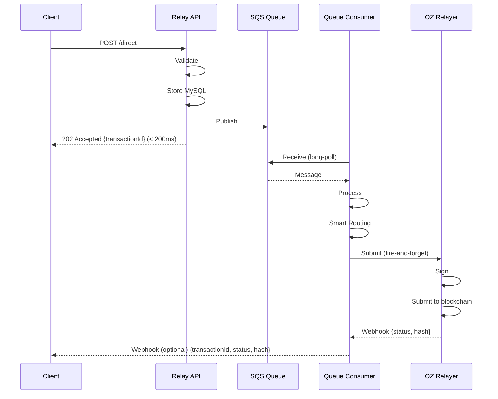

# Queue Integration Guide

**Document Version**: 1.0.0
**Last Updated**: 2026-01-06
**Status**: Complete
**SPEC**: [SPEC-QUEUE-001](./../.moai/specs/SPEC-QUEUE-001/spec.md)

## Table of Contents

1. [Overview](#overview)
2. [SQS Adapter Usage](#sqs-adapter-usage)
3. [Message Publishing](#message-publishing)
4. [Message Consumption](#message-consumption)
5. [Migration Guide](#migration-guide-legacy-to-queue)
6. [Error Handling](#error-handling)
7. [Testing](#testing)

---

## Overview

The Queue Integration provides an abstraction layer for SQS operations, enabling seamless async transaction processing in both local (LocalStack) and production (AWS) environments.

### Key Abstractions

| Component | Purpose |
|-----------|---------|
| `SqsAdapter` | Unified SQS client (LocalStack/AWS) |
| `QueueService` | Business logic for message operations |
| `ConsumerService` | Message polling and processing orchestration |
| `Configuration` | Environment-based setup |

### Dual Credentials Strategy

```typescript
// Local Development (docker-compose.yaml)
SQS_ENDPOINT_URL=http://localhost:4566  // LocalStack endpoint
AWS_ACCESS_KEY_ID=test
AWS_SECRET_ACCESS_KEY=test
AWS_REGION=ap-northeast-2

// Production (AWS)
// SQS_ENDPOINT_URL is omitted
// Uses IAM Instance Role from ECS/EKS
```

---

## SQS Adapter Usage

### SqsAdapter Class

```typescript
// File: packages/queue-consumer/src/sqs/sqs.adapter.ts

import { SQSClient, SendMessageCommand, ReceiveMessageCommand } from '@aws-sdk/client-sqs';

@Injectable()
export class SqsAdapter {
  private readonly client: SQSClient;

  constructor(private configService: ConfigService) {
    const config: SQSClientConfig = {
      region: configService.get('AWS_REGION'),
    };

    // Use LocalStack for local development
    if (configService.get('SQS_ENDPOINT_URL')) {
      config.endpoint = configService.get('SQS_ENDPOINT_URL');
      config.credentials = {
        accessKeyId: configService.get('AWS_ACCESS_KEY_ID'),
        secretAccessKey: configService.get('AWS_SECRET_ACCESS_KEY'),
      };
    }
    // Production: IAM Instance Role (auto-configured)

    this.client = new SQSClient(config);
  }

  async sendMessage(queueUrl: string, messageBody: any): Promise<string> {
    const command = new SendMessageCommand({
      QueueUrl: queueUrl,
      MessageBody: JSON.stringify(messageBody),
    });
    const response = await this.client.send(command);
    return response.MessageId;
  }

  async receiveMessages(queueUrl: string, maxMessages: number = 1): Promise<Message[]> {
    const command = new ReceiveMessageCommand({
      QueueUrl: queueUrl,
      MaxNumberOfMessages: maxMessages,
      WaitTimeSeconds: 20,
      VisibilityTimeout: 60,
    });
    const response = await this.client.send(command);
    return response.Messages || [];
  }

  async deleteMessage(queueUrl: string, receiptHandle: string): Promise<void> {
    const command = new DeleteMessageCommand({
      QueueUrl: queueUrl,
      ReceiptHandle: receiptHandle,
    });
    await this.client.send(command);
  }
}
```

### Configuration

```typescript
// File: packages/queue-consumer/src/config/configuration.ts

export const configuration = () => ({
  sqs: {
    region: process.env.AWS_REGION || 'ap-northeast-2',
    queueUrl: process.env.SQS_QUEUE_URL,
    dlqUrl: process.env.SQS_DLQ_URL,
    endpointUrl: process.env.SQS_ENDPOINT_URL, // LocalStack only
    visibilityTimeout: parseInt(process.env.SQS_VISIBILITY_TIMEOUT || '60'),
    waitTimeSeconds: parseInt(process.env.SQS_WAIT_TIME_SECONDS || '20'),
    maxReceiveCount: parseInt(process.env.SQS_MAX_RECEIVE_COUNT || '3'),
  },
  aws: {
    accessKeyId: process.env.AWS_ACCESS_KEY_ID,
    secretAccessKey: process.env.AWS_SECRET_ACCESS_KEY,
  },
});
```

---

## Message Publishing

### relay-api: Publishing to Queue

```typescript
// File: packages/relay-api/src/queue/queue.service.ts

import { Injectable } from '@nestjs/common';
import { ConfigService } from '@nestjs/config';
import { SqsAdapter } from '../sqs/sqs.adapter';

@Injectable()
export class QueueService {
  constructor(
    private readonly sqsAdapter: SqsAdapter,
    private readonly configService: ConfigService,
  ) {}

  async publishDirectTransaction(req: DirectTransactionDto): Promise<string> {
    const queueUrl = this.configService.get('SQS_QUEUE_URL');

    const message = {
      messageId: generateUuid(),
      transactionId: generateUuid(),
      type: 'direct',
      request: req,
      timestamp: new Date().toISOString(),
    };

    const messageId = await this.sqsAdapter.sendMessage(queueUrl, message);
    return message.transactionId; // Return for immediate response
  }

  async publishGaslessTransaction(req: GaslessTransactionDto): Promise<string> {
    const queueUrl = this.configService.get('SQS_QUEUE_URL');

    const message = {
      messageId: generateUuid(),
      transactionId: generateUuid(),
      type: 'gasless',
      request: req,
      timestamp: new Date().toISOString(),
    };

    await this.sqsAdapter.sendMessage(queueUrl, message);
    return message.transactionId;
  }
}
```

### Controller Integration

```typescript
// File: packages/relay-api/src/relay/direct/direct.controller.ts

@Post()
async submitTransaction(@Body() req: DirectTransactionDto): Promise<DirectTxResponse> {
  const transactionId = await this.queueService.publishDirectTransaction(req);

  // Save to MySQL with pending status
  await this.transactionService.createTransaction({
    id: transactionId,
    type: 'direct',
    status: 'pending',
    request: req,
  });

  return {
    transactionId,
    status: 'pending',
    createdAt: new Date().toISOString(),
  }; // 202 Accepted
}
```

---

## Message Consumption

### queue-consumer: Polling and Processing

```typescript
// File: packages/queue-consumer/src/consumer.service.ts

import { Injectable, Logger } from '@nestjs/common';
import { SqsAdapter } from './sqs/sqs.adapter';
import { PrismaService } from './prisma/prisma.service';
import { OzRelayerClient } from './relay/oz-relayer.client';

@Injectable()
export class ConsumerService {
  private readonly logger = new Logger(ConsumerService.name);
  private isRunning = true;

  constructor(
    private readonly sqsAdapter: SqsAdapter,
    private readonly prisma: PrismaService,
    private readonly ozRelayer: OzRelayerClient,
    private readonly configService: ConfigService,
  ) {}

  async start(): Promise<void> {
    const queueUrl = this.configService.get('SQS_QUEUE_URL');

    while (this.isRunning) {
      try {
        // 1. Long-poll messages from SQS
        const messages = await this.sqsAdapter.receiveMessages(queueUrl, 10);

        for (const message of messages) {
          await this.processMessage(message);
        }
      } catch (error) {
        this.logger.error('Consumer error:', error);
        // Continue polling (don't crash)
      }

      // Small delay to avoid tight loop
      await this.sleep(1000);
    }
  }

  private async processMessage(message: Message): Promise<void> {
    try {
      const payload = JSON.parse(message.Body);
      const { transactionId, type, request } = payload;

      // 2. Check idempotency
      const tx = await this.prisma.transaction.findUnique({
        where: { id: transactionId },
      });

      if (tx.status === 'success' || tx.status === 'failed') {
        // Already processed, skip
        this.logger.log(`Transaction ${transactionId} already processed`);
        await this.deleteMessage(message);
        return;
      }

      // 3. Submit to OZ Relayer
      const result = await this.ozRelayer.relay(type, request);

      // 4. Update success
      await this.prisma.transaction.update({
        where: { id: transactionId },
        data: {
          status: 'success',
          result,
          hash: result.hash,
        },
      });

      // 5. Delete from queue
      await this.deleteMessage(message);
      this.logger.log(`Transaction ${transactionId} completed successfully`);
    } catch (error) {
      this.logger.error(`Error processing message:`, error);
      // DO NOT DELETE - let visibility timeout handle retry
      // SQS will automatically make message visible again after 60s
    }
  }

  private async deleteMessage(message: Message): Promise<void> {
    const queueUrl = this.configService.get('SQS_QUEUE_URL');
    await this.sqsAdapter.deleteMessage(queueUrl, message.ReceiptHandle);
  }

  async stop(): Promise<void> {
    this.logger.log('Stopping consumer...');
    this.isRunning = false;

    // Wait for in-flight messages (max 120s)
    const startTime = Date.now();
    while (this.processingCount > 0 && Date.now() - startTime < 120000) {
      await this.sleep(100);
    }

    this.logger.log('Consumer stopped');
  }

  private sleep(ms: number): Promise<void> {
    return new Promise((resolve) => setTimeout(resolve, ms));
  }
}
```

### Entry Point

```typescript
// File: packages/queue-consumer/src/main.ts

import { NestFactory } from '@nestjs/core';
import { ConsumerModule } from './consumer.module';
import { ConsumerService } from './consumer.service';

async function bootstrap() {
  const app = await NestFactory.create(ConsumerModule);
  const consumerService = app.get(ConsumerService);

  // Handle graceful shutdown
  process.on('SIGTERM', async () => {
    console.log('SIGTERM received, shutting down gracefully...');
    await consumerService.stop();
    process.exit(0);
  });

  // Start consumer
  await consumerService.start();
}

bootstrap().catch((err) => {
  console.error('Fatal error:', err);
  process.exit(1);
});
```

---

## Migration Guide: Legacy to Queue

### Before (Synchronous)

```typescript
@Post('/relay/direct')
async submitTransaction(@Body() req: DirectTxDto): Promise<TxResponse> {
  // Direct call to OZ Relayer (blocking)
  const result = await this.ozRelayer.relay(req);

  // Return hash immediately (tight coupling)
  return {
    hash: result.hash,
    status: 'success',
    transactionId: result.transactionId,
  }; // 200 OK
}
```

**Advantages**:
- Simple, synchronous flow
- Client gets result immediately
- No background processing overhead

**Disadvantages**:
- Throughput limited by OZ Relayer latency (~200ms)
- Tight coupling: API Gateway can't operate without OZ Relayer
- No independent scaling
- Client must wait for full processing

### After (Asynchronous with Queue)

```typescript
@Post('/relay/direct')
async submitTransaction(@Body() req: DirectTxDto): Promise<TxQueuedResponse> {
  // Save to database
  const tx = await this.prisma.transaction.create({
    data: {
      id: generateUuid(),
      type: 'direct',
      status: 'pending',
      request: req,
    },
  });

  // Publish to queue (async)
  await this.queueService.publishDirectTransaction(tx.id, req);

  // Return immediately
  return {
    transactionId: tx.id,
    status: 'pending',
    createdAt: new Date().toISOString(),
  }; // 202 Accepted
}
```

**Advantages**:
- Fast response time (~10ms)
- Independent scaling (API + Consumer)
- Resilient: Loose coupling
- Built-in retry and DLQ handling
- Audit trail (full transaction history)

**Disadvantages**:
- Asynchronous: Client must poll or use webhook
- Slightly more complex
- Added complexity from queue infrastructure

### Client Migration Path

#### Step 1: Update Request Handling

```typescript
// Before
const response = await fetch('POST /relay/direct', payload);
const { hash, status } = await response.json(); // Immediate result

// After
const response = await fetch('POST /relay/direct', payload);
const { transactionId, status } = await response.json(); // 202 Accepted
```

#### Step 2: Implement Status Polling

```typescript
// Poll for completion
async function waitForTransaction(transactionId: string): Promise<TxResult> {
  const maxRetries = 120; // 2 minutes
  let retries = 0;

  while (retries < maxRetries) {
    const response = await fetch(`GET /relay/status/${transactionId}`);
    const tx = await response.json();

    if (tx.status === 'success' || tx.status === 'failed') {
      return tx; // Terminal state
    }

    retries++;
    await sleep(1000); // Wait 1 second before retrying
  }

  throw new Error('Transaction timeout');
}
```

#### Step 3: Alternative - Use Webhooks

```typescript
// Register webhook URL
const response = await fetch('POST /webhooks/register', {
  url: 'https://client.example.com/webhooks/transaction-status',
  events: ['transaction.completed', 'transaction.failed'],
});

// Server will POST to webhook when transaction completes
// POST https://client.example.com/webhooks/transaction-status
// {
//   "event": "transaction.completed",
//   "transactionId": "UUID",
//   "status": "success",
//   "hash": "0x...",
//   "confirmedAt": "ISO8601"
// }
```

---

## Error Handling

### Producer Side (relay-api)

```typescript
async publishTransaction(req: TxRequest): Promise<TransactionId> {
  try {
    // Validate request
    if (!req.to || !isValidAddress(req.to)) {
      throw new BadRequestException('Invalid recipient address');
    }

    // Save to database
    const tx = await this.prisma.transaction.create({
      data: { /* ... */ },
    });

    // Publish to SQS
    try {
      await this.queueService.publishTransaction(tx);
    } catch (error) {
      // SQS error: Log and return 503
      this.logger.error('Failed to publish to SQS', error);
      throw new ServiceUnavailableException('Queue service unavailable');
    }

    return tx.id;
  } catch (error) {
    // Log and re-throw for HTTP error handler
    this.logger.error('Failed to submit transaction', error);
    throw error;
  }
}
```

### Consumer Side (queue-consumer)

```typescript
async processMessage(message: Message): Promise<void> {
  const payload = JSON.parse(message.Body);
  const { transactionId, request } = payload;

  try {
    // Idempotency check
    const tx = await this.prisma.transaction.findUnique({
      where: { id: transactionId },
    });

    if (tx.status !== 'pending') {
      // Already processed
      await this.deleteMessage(message);
      return;
    }

    // Submit to OZ Relayer
    const result = await this.ozRelayer.relay(request);

    // Update success
    await this.prisma.transaction.update({
      where: { id: transactionId },
      data: { status: 'success', result, hash: result.hash },
    });

    await this.deleteMessage(message);
  } catch (error) {
    // Check ApproximateReceiveCount
    const receiveCount = parseInt(message.Attributes.ApproximateReceiveCount);

    if (receiveCount >= 3) {
      // Max retries reached, move to DLQ handling
      await this.prisma.transaction.update({
        where: { id: transactionId },
        data: {
          status: 'failed',
          error_message: error.message,
        },
      });
      await this.deleteMessage(message); // Or let SQS move to DLQ
      this.logger.error(`Transaction ${transactionId} failed after 3 retries`, error);
    } else {
      // Retry: Do NOT delete message
      this.logger.warn(
        `Transaction ${transactionId} failed, will retry (attempt ${receiveCount + 1}/3)`,
        error,
      );
    }
  }
}
```

### Handling DLQ Messages

```typescript
// Manually process DLQ messages
async processDlqMessages(): Promise<void> {
  const dlqUrl = this.configService.get('SQS_DLQ_URL');

  const messages = await this.sqsAdapter.receiveMessages(dlqUrl, 10);

  for (const message of messages) {
    try {
      const payload = JSON.parse(message.Body);
      const { transactionId } = payload;

      // Log for investigation
      this.logger.error(`DLQ Message: ${transactionId}`, payload);

      // Mark as failed in database
      await this.prisma.transaction.update({
        where: { id: transactionId },
        data: {
          status: 'failed',
          error_message: 'Message moved to DLQ after 3 retries',
        },
      });

      // Delete from DLQ
      await this.sqsAdapter.deleteMessage(dlqUrl, message.ReceiptHandle);
    } catch (error) {
      this.logger.error('Error processing DLQ message', error);
    }
  }
}
```

---

## Testing

### Unit Tests

```typescript
// File: packages/queue-consumer/src/consumer.service.spec.ts

describe('ConsumerService', () => {
  let service: ConsumerService;
  let sqsAdapter: MockSqsAdapter;
  let prisma: MockPrismaService;
  let ozRelayer: MockOzRelayerClient;

  beforeEach(async () => {
    // Setup mocks
    sqsAdapter = new MockSqsAdapter();
    prisma = new MockPrismaService();
    ozRelayer = new MockOzRelayerClient();

    service = new ConsumerService(sqsAdapter, prisma, ozRelayer, configService);
  });

  it('should process message successfully', async () => {
    // Arrange
    const message = {
      Body: JSON.stringify({
        transactionId: 'tx-123',
        type: 'direct',
        request: { to: '0x...', data: '0x' },
      }),
      ReceiptHandle: 'handle-123',
    };

    prisma.transaction.findUnique.mockResolvedValue({
      id: 'tx-123',
      status: 'pending',
    });

    ozRelayer.relay.mockResolvedValue({
      hash: '0x123...',
      transactionId: 'tx-123',
    });

    // Act
    await service.processMessage(message);

    // Assert
    expect(prisma.transaction.update).toHaveBeenCalledWith({
      where: { id: 'tx-123' },
      data: {
        status: 'success',
        result: { hash: '0x123...', transactionId: 'tx-123' },
        hash: '0x123...',
      },
    });

    expect(sqsAdapter.deleteMessage).toHaveBeenCalledWith('handle-123');
  });

  it('should handle duplicate messages (idempotency)', async () => {
    // Transaction already processed
    prisma.transaction.findUnique.mockResolvedValue({
      id: 'tx-123',
      status: 'success', // Already completed
    });

    await service.processMessage(message);

    // Should delete without processing
    expect(sqsAdapter.deleteMessage).toHaveBeenCalled();
    expect(ozRelayer.relay).not.toHaveBeenCalled();
  });

  it('should not delete message on OZ Relayer error', async () => {
    prisma.transaction.findUnique.mockResolvedValue({
      id: 'tx-123',
      status: 'pending',
    });

    ozRelayer.relay.mockRejectedValue(new Error('Relay error'));

    await service.processMessage(message);

    // Should NOT delete message (retry will happen)
    expect(sqsAdapter.deleteMessage).not.toHaveBeenCalled();
  });
});
```

### Integration Tests

```typescript
// File: packages/queue-consumer/test/consumer.e2e.spec.ts

describe('Consumer End-to-End', () => {
  let app: INestApplication;
  let sqsAdapter: SqsAdapter;
  let consumerService: ConsumerService;

  beforeAll(async () => {
    // Start LocalStack
    const localstack = await docker.run('localstack/localstack:latest', {
      ports: [{ container: 4566, host: 4566 }],
    });

    // Create SQS queues
    // ...

    const moduleFixture = await Test.createTestingModule({
      imports: [ConsumerModule],
    })
      .overrideProvider(ConfigService)
      .useValue(mockConfigService)
      .compile();

    app = moduleFixture.createNestApplication();
    await app.init();

    sqsAdapter = moduleFixture.get(SqsAdapter);
    consumerService = moduleFixture.get(ConsumerService);
  });

  it('should process complete transaction flow', async () => {
    // 1. Publish message to SQS
    const message = {
      transactionId: 'tx-e2e-123',
      type: 'direct',
      request: { to: '0x...', data: '0x' },
    };

    await sqsAdapter.sendMessage(queueUrl, message);

    // 2. Process message
    const tx = await consumerService.processOneMessage();

    // 3. Verify result in database
    const result = await prisma.transaction.findUnique({
      where: { id: 'tx-e2e-123' },
    });

    expect(result.status).toBe('success');
    expect(result.hash).toBeDefined();
  });
});
```

---

## Fire-and-Forget Pattern (SPEC-ROUTING-001)

### Overview

The Fire-and-Forget pattern combines the queue system with immediate response to clients. The API returns `202 Accepted` immediately after enqueueing, then processes the transaction asynchronously via the consumer.

### Request Flow



### Implementation

**Queue Consumer Processing**:

```typescript
// File: packages/queue-consumer/src/consumer.service.ts

async processQueueMessage(message: QueueMessage): Promise<void> {
  const { transactionId, clientId, txData } = message;

  try {
    // Step 1: Select best relayer (Smart Routing)
    const relayerUrl = await this.relayerRouter.getAvailableRelayer();

    // Step 2: Submit fire-and-forget (no polling)
    const result = await this.ozRelayerClient.sendDirectTransactionAsync(
      txData,
      relayerUrl,
    );

    // Step 3: Store OZ Relayer TX ID for webhook matching
    await this.repository.updateTransaction(transactionId, {
      ozRelayerTxId: result.transactionId,
      relayerUrl: relayerUrl,
      status: 'submitted', // Waiting for webhook confirmation
    });

    // Step 4: Delete from queue (fire-and-forget complete)
    await this.sqsAdapter.deleteMessage(message.receiptHandle);

    this.logger.log(
      `[Fire-and-Forget] TX ${transactionId} submitted to ${relayerUrl}`,
    );
  } catch (error) {
    this.logger.error(`Failed to submit TX ${transactionId}:`, error);
    // Message will be retried by SQS (visibility timeout)
    // Eventually sent to DLQ if max retries exceeded
  }
}
```

### Benefits

| Benefit | Impact |
|---------|--------|
| **API Latency** | 200-300ms (vs. 2-5s with polling) |
| **Throughput** | 12x improvement (32 TPS vs. 2.6 TPS) |
| **CPU Usage** | Lower (no blocking polling) |
| **Scalability** | Easier to scale consumers |

### Webhook-Based Status Updates

Transactions submitted via Fire-and-Forget receive status updates through webhooks:

```typescript
// File: packages/relay-api/src/webhooks/webhooks.controller.ts

@Post('oz-relayer')
@UseGuards(WebhookSignatureGuard)
async handleOzRelayerWebhook(
  @Body() payload: OzRelayerWebhookDto,
): Promise<void> {
  const { ozRelayerTxId, status, hash, oz_relayer_url } = payload;

  // Find transaction by OZ Relayer TX ID
  const transaction = await this.repository.findByOzRelayerTxId(
    ozRelayerTxId,
  );

  if (!transaction) {
    this.logger.warn(`TX not found: ${ozRelayerTxId}`);
    return; // Idempotent: ignore unknown TX
  }

  // Update transaction status
  await this.repository.updateTransaction(transaction.id, {
    status: status,
    hash: hash,
    confirmedAt: new Date(),
    oz_relayer_url: oz_relayer_url,
  });

  // Invalidate Redis cache
  await this.cache.invalidate(`tx:${transaction.id}`);

  this.logger.log(`Updated TX ${transaction.id} → ${status}`);
}
```

### Idempotency

Fire-and-Forget processing is idempotent at multiple levels:

1. **Transaction ID**: Unique per submission
2. **SQS Message ID**: Unique per queue message
3. **Webhook Idempotency**: Status updates are idempotent (same final state)

### Comparison: Fire-and-Forget vs. Polling

| Aspect | Polling (OLD) | Fire-and-Forget (NEW) |
|--------|---------------|----------------------|
| API Response Time | 2-5 seconds | 200-300ms |
| Worker Blocking | Yes (8 blocked) | No (0.5-1 blocked) |
| Throughput | 2.6 TPS | 32 TPS |
| Complexity | Simple | Requires webhooks |
| Error Handling | Retry in API | Retry via SQS |
| Status Tracking | Poll-based | Event-based |

---

## Summary

The Queue Integration Guide provides:

- ✅ SQS Adapter for unified client interface
- ✅ Message publishing from relay-api
- ✅ Long-polling consumption in queue-consumer
- ✅ Idempotent processing
- ✅ Migration path from sync to async
- ✅ Comprehensive error handling
- ✅ Testing patterns

For complete technical specifications, see [SPEC-QUEUE-001](./../.moai/specs/SPEC-QUEUE-001/spec.md).
