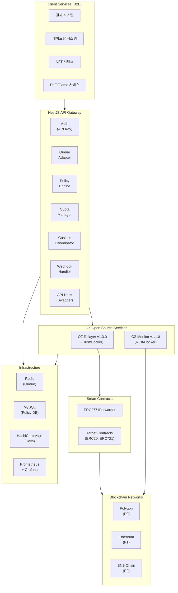
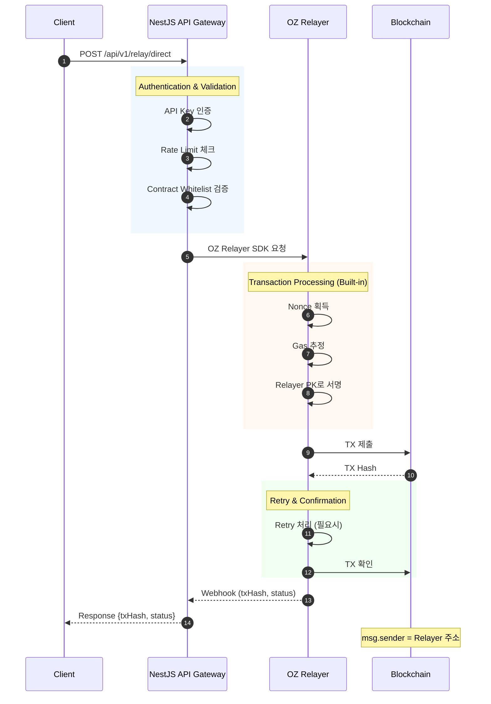
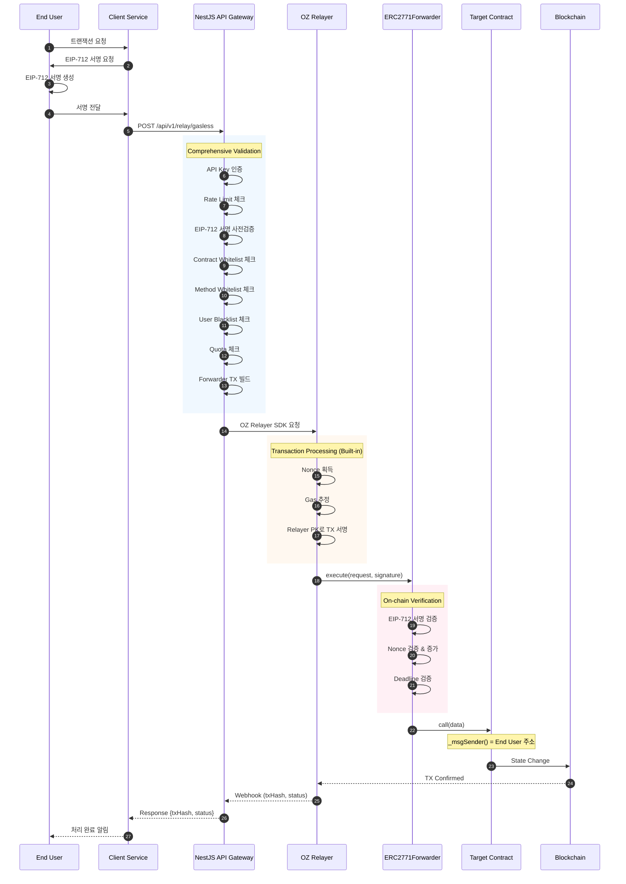

# MSQ Relayer Service - 구조 문서

## 문서 정보
- **버전**: 7.0
- **최종 수정일**: 2025-12-15
- **상태**: Phase 1 구현 단계 (Direct + Gasless + Multi-Relayer Pool)

### 관련 문서
- [제품 요구사항](./product.md)
- [기술 스택 및 API 스펙](./tech.md)
- [Task Master PRD](../.taskmaster/docs/prd.txt)

---

## 프로젝트 구조 개요

MSQ Relayer Service는 **B2B Infrastructure**로, 내부 Client Services(결제, 에어드랍, NFT 서비스 등)가 블록체인 트랜잭션을 쉽게 처리할 수 있도록 지원합니다.

**OZ 오픈소스(Relayer + Monitor)**를 핵심으로 활용하며, NestJS API Gateway가 인증/정책/할당량 관리를 담당합니다.

### 구현 범위

| Phase | 범위 | 상태 |
|-------|------|------|
| **Phase 1** | OZ Relayer + Redis, Auth, Health, Direct TX, Gasless TX, ERC2771Forwarder, EIP-712 검증, 결제 시스템 연동 | 🔄 구현 중 |
| **Phase 2+** | Queue System (Redis/SQS), OZ Monitor, Policy Engine, Quota Manager, Vault, Kubernetes | 📋 계획됨 |

---

## 1. 시스템 아키텍처

### 1.1 High-Level Architecture (v4.0 B2B Infrastructure)

```
┌─────────────────────────────────────────────────────────────────┐
│                    Client Services (B2B)                         │
│  ┌───────────┐ ┌───────────┐ ┌───────────┐ ┌───────────────┐   │
│  │ 결제       │ │ 에어드랍   │ │ NFT       │ │ DeFi/Game     │   │
│  │ 시스템     │ │ 시스템     │ │ 서비스    │ │ 서비스        │   │
│  └───────────┘ └───────────┘ └───────────┘ └───────────────┘   │
└─────────────────────────────────┬───────────────────────────────┘
                                  │
                                  ▼
┌─────────────────────────────────────────────────────────────────┐
│                   NestJS API Gateway (개발 필요)                 │
│  ┌───────────┐ ┌───────────┐ ┌───────────┐ ┌───────────────┐   │
│  │ Auth      │ │ Queue     │ │ Policy    │ │ Quota         │   │
│  │ (API Key) │ │ Adapter   │ │ Engine    │ │ Manager       │   │
│  └───────────┘ └───────────┘ └───────────┘ └───────────────┘   │
│  ┌───────────┐ ┌───────────┐ ┌───────────────────────────────┐ │
│  │ Gasless   │ │ Webhook   │ │ API Documentation             │ │
│  │Coordinator│ │ Handler   │ │ (Swagger/OpenAPI)             │ │
│  └───────────┘ └───────────┘ └───────────────────────────────┘ │
└─────────────────────────────────┬───────────────────────────────┘
                                  │
          ┌───────────────────────┼───────────────────────┐
          │                       │                       │
          ▼                       ▼                       ▼
┌─────────────────┐   ┌─────────────────┐   ┌─────────────────┐
│  OZ Relayer     │   │  OZ Monitor     │   │ Smart Contracts │
│  v1.3.0 (Rust)  │   │  v1.1.0 (Rust)  │   │ (Solidity)      │
│  ─────────────  │   │  ─────────────  │   │ ─────────────   │
│  • EVM TX Relay │   │  • Block Watch  │   │ • ERC2771       │
│  • Nonce Mgmt   │   │  • Event Filter │   │   Forwarder     │
│  • Gas Estimate │   │  • Balance Alert│   │ • Sample ERC20  │
│  • Signing      │   │  • Slack/Discord│   │ • Sample ERC721 │
│  • Webhook      │   │  • Custom Script│   │                 │
│  Port: 8080     │   │                 │   │                 │
└────────┬────────┘   └────────┬────────┘   └─────────────────┘
         │                     │
         └──────────┬──────────┘
                    ▼
┌─────────────────────────────────────────────────────────────────┐
│                      Infrastructure                              │
│  ┌───────────┐ ┌───────────┐ ┌───────────┐ ┌───────────────┐   │
│  │ Redis     │ │ MySQL     │ │ Prometheus│ │ HashiCorp     │   │
│  │ (Queue)   │ │ (Policy)  │ │ + Grafana │ │ Vault (Keys)  │   │
│  └───────────┘ └───────────┘ └───────────┘ └───────────────┘   │
└─────────────────────────────────────────────────────────────────┘
                    │
                    ▼
┌─────────────────────────────────────────────────────────────────┐
│                    Blockchain Networks                           │
│  ┌───────────┐ ┌───────────┐ ┌───────────┐                     │
│  │ Polygon   │ │ Ethereum  │ │ BNB Chain │                     │
│  │ (P0)      │ │ (P1)      │ │ (P2)      │                     │
│  └───────────┘ └───────────┘ └───────────┘                     │
└─────────────────────────────────────────────────────────────────┘
```

#### Mermaid Architecture Diagram



### 1.2 OZ 서비스 역할 분리

| 컴포넌트 | 역할 | 구현 방식 | Phase |
|----------|------|-----------|-------|
| **OZ Relayer Pool** | TX 중계, Nonce/Gas/Retry (Multi-Instance) | Docker 이미지 (설정만) | Phase 1 |
| **OZ Monitor** | 이벤트 감지, 잔액 알림 | Docker 이미지 (설정만) | Phase 2+ |
| **NestJS Gateway** | 인증, Load Balancing, Direct TX, Gasless TX, EIP-712 검증 | Custom 개발 | Phase 1 (프로덕션) |
| **ERC2771Forwarder** | Meta-TX Forwarder | OZ Contracts 배포 | Phase 1 |

### 1.3 Multi-Relayer Pool Architecture

**Relayer Pool 방식**: 각 Relayer가 독립적인 Private Key를 보유하여 Nonce 충돌 없이 병렬 처리

```
┌─────────────────────────────────────────────────────────────┐
│                NestJS API Gateway (Load Balancer)            │
│  ┌───────────┐ ┌───────────────┐ ┌─────────────────────┐   │
│  │ Auth      │ │ Relayer       │ │ Pool Health         │   │
│  │ Module    │ │ Router        │ │ Monitor             │   │
│  └───────────┘ └───────────────┘ └─────────────────────┘   │
└─────────────────────────┬───────────────────────────────────┘
                          │ Routing Strategy: Round Robin / Least Load
          ┌───────────────┼───────────────┐
          ▼               ▼               ▼
┌─────────────────┐ ┌─────────────────┐ ┌─────────────────┐
│ OZ Relayer #1   │ │ OZ Relayer #2   │ │ OZ Relayer #N   │
│ ─────────────── │ │ ─────────────── │ │ ─────────────── │
│ Key: 0xAAA...   │ │ Key: 0xBBB...   │ │ Key: 0xNNN...   │
│ Balance: 1 ETH  │ │ Balance: 1 ETH  │ │ Balance: 1 ETH  │
│ Status: Active  │ │ Status: Active  │ │ Status: Standby │
└────────┬────────┘ └────────┬────────┘ └────────┬────────┘
         │                   │                   │
         └───────────────────┴───────────────────┘
                             │
                             ▼
                    ┌─────────────────┐
                    │     Redis       │
                    │  (Shared Queue) │
                    └─────────────────┘
```

**Pool 관리 기능**:
| 기능 | 설명 | Phase |
|------|------|-------|
| Relayer Registry | Pool 내 Relayer 목록 관리 | Phase 1 |
| Health Check | 각 Relayer 상태 모니터링 | Phase 1 |
| Load Balancing | Round Robin / Least Load 라우팅 | Phase 1 |
| Manual Scaling | Relayer 수동 추가/제거 | Phase 1 |
| Auto Scaling | Queue Depth 기반 자동 스케일링 | Phase 2+ |

**Scaling 전략**:
- **Phase 1**: 1개로 시작, 수동으로 확장 (최대 N개)
- **Phase 2+**: Kubernetes HPA 또는 Queue Depth 기반 자동 스케일링

### 1.3 Unified Request Flow

```
┌──────────────────────────────────────────────────────────────┐
│                        API Layer                              │
├──────────────┬──────────────┬─────────────┬─────────────────┤
│ POST         │ POST         │ GET         │ GET             │
│ /relay/direct│ /relay/gasless│ /relay/nonce│ /relay/status   │
└──────┬───────┴──────┬───────┴──────┬──────┴────────┬────────┘
       │              │              │               │
       ▼              ▼              │               │
┌──────────────┐ ┌───────────────────┴───────────────┴────────┐
│ Direct Path  │ │           Gasless Middleware               │
├──────────────┤ ├────────────────────────────────────────────┤
│ Whitelist 검증│ │ 1. Signature Verifier (EIP-712 사전검증)   │
│ (NestJS)     │ │ 2. Policy Engine (Contract/Method 제한)   │
└──────┬───────┘ │ 3. Quota Manager (사용량 제한)            │
       │         │ 4. Forwarder TX Builder                   │
       │         └────────────────────┬───────────────────────┘
       │                              │
       └──────────────┬───────────────┘
                      ▼
┌─────────────────────────────────────────────────────────────┐
│                 OZ Relayer (v1.3.0 Rust)                     │
├─────────────┬─────────────┬─────────────┬───────────────────┤
│ Nonce       │ Gas         │ Signer      │ Queue             │
│ Manager     │ Estimator   │ Service     │ (Redis)           │
├─────────────┴─────────────┴─────────────┴───────────────────┤
│                    Retry Handler (내장)                      │
├─────────────────────────────────────────────────────────────┤
│                 Transaction Submitter                        │
└─────────────────────────────────────────────────────────────┘
```

---

## 2. 보안 제어 레이어

OpenZeppelin 공식 권고에 따라 Contract/Method Whitelist 등 보안 제어는 **NestJS API Gateway**에서 구현합니다.

```
Request → [API Key 인증] → [Rate Limiting] → [Contract Whitelist]
                                                    ↓
         [Method Whitelist] ← [User Blacklist] ← [Quota 체크]
                                                    ↓
         [EIP-712 서명 사전검증] → OZ Relayer → [Forwarder.execute()]
         (NestJS)                 (Rust)        (온체인)
                                                    ↓
         OZ Forwarder: [EIP-712 검증] → [Nonce 관리] → [Deadline 검증]
                       (온체인)        (온체인)        (온체인)
```

---

## 3. 디렉토리 구조 (v4.0 - Multi-Relayer Pool)

```
msq-relayer-service/
├── docker-compose.yml              # Multi-Relayer Pool + Monitor + Redis + Vault
├── docker-compose.override.yml     # 로컬 환경 오버라이드
├── .env.example                    # 환경 변수 예시
├── Makefile                        # 빌드/배포 스크립트
│
├── config/                         # OZ 서비스 설정
│   ├── oz-relayer/                 # OZ Relayer Pool 설정
│   │   ├── relayer-1/              # Relayer #1 설정 (Key: 0xAAA...)
│   │   │   └── config.json
│   │   ├── relayer-2/              # Relayer #2 설정 (Key: 0xBBB...) [scale profile]
│   │   │   └── config.json
│   │   └── relayer-n/              # Relayer #N 설정
│   │       └── config.json
│   ├── relayer-pool.yaml           # Pool 설정 (Load Balancing, Health Check)
│   └── oz-monitor/                 # OZ Monitor 설정 (Phase 2+)
│       ├── networks/               # 네트워크 설정
│       ├── monitors/               # 모니터 설정
│       └── triggers/               # 트리거 설정
│
├── keys/                           # Signer 키스토어 (gitignore)
│   ├── relayer-1/                  # Relayer #1 키스토어
│   │   └── keystore.json
│   ├── relayer-2/                  # Relayer #2 키스토어
│   │   └── keystore.json
│   └── relayer-n/                  # Relayer #N 키스토어
│       └── keystore.json
│
├── packages/
│   ├── api-gateway/                # NestJS API Gateway (Custom 개발)
│   │   ├── Dockerfile              # 패키지별 Dockerfile
│   │   ├── .dockerignore           # Docker 빌드 제외 파일
│   │   ├── src/
│   │   │   ├── auth/               # API Key 인증 모듈
│   │   │   │   ├── auth.module.ts
│   │   │   │   ├── auth.guard.ts
│   │   │   │   └── api-key.service.ts
│   │   │   │
│   │   │   ├── relay/              # Relay 엔드포인트
│   │   │   │   ├── relay.module.ts
│   │   │   │   ├── direct/         # Direct TX 컨트롤러
│   │   │   │   │   ├── direct.controller.ts
│   │   │   │   │   └── direct.service.ts
│   │   │   │   ├── gasless/        # Gasless TX 컨트롤러
│   │   │   │   │   ├── gasless.controller.ts
│   │   │   │   │   └── gasless.service.ts
│   │   │   │   └── status/         # 상태 조회
│   │   │   │       ├── status.controller.ts
│   │   │   │       └── status.service.ts
│   │   │   │
│   │   │   ├── policy/             # Policy Engine (백엔드 보안)
│   │   │   │   ├── policy.module.ts
│   │   │   │   ├── whitelist.service.ts
│   │   │   │   ├── blacklist.service.ts
│   │   │   │   └── rules.service.ts
│   │   │   │
│   │   │   ├── quota/              # Quota Manager
│   │   │   │   ├── quota.module.ts
│   │   │   │   └── quota.service.ts
│   │   │   │
│   │   │   ├── webhook/            # OZ Relayer Webhook 핸들러
│   │   │   │   ├── webhook.module.ts
│   │   │   │   └── webhook.controller.ts
│   │   │   │
│   │   │   ├── oz-relayer/         # OZ Relayer SDK 래퍼
│   │   │   │   ├── oz-relayer.module.ts
│   │   │   │   └── oz-relayer.service.ts
│   │   │   │
│   │   │   ├── common/             # 공유 유틸리티
│   │   │   │   ├── filters/
│   │   │   │   ├── interceptors/
│   │   │   │   └── decorators/
│   │   │   │
│   │   │   └── main.ts
│   │   │
│   │   ├── prisma/                 # DB 스키마
│   │   │   └── schema.prisma
│   │   │
│   │   └── package.json
│   │
│   │
│   ├── contracts/                  # Smart Contracts (OZ 활용)
│   │   ├── contracts/
│   │   │   └── tokens/
│   │   │       ├── SampleToken.sol # ERC20 + ERC2771Context
│   │   │       └── SampleNFT.sol   # ERC721 + ERC2771Context
│   │   ├── scripts/
│   │   │   └── deploy-forwarder.ts
│   │   ├── hardhat.config.ts
│   │   └── package.json
│   │
│   └── examples/                   # 통합 예제
│       ├── src/
│       │   ├── direct-tx/          # Direct Transaction 예제
│       │   ├── gasless-tx/         # Gasless Transaction 예제
│       │   ├── contracts/          # 스마트 컨트랙트 배포 예제
│       │   └── integration/        # React, Node.js 통합 예제
│       ├── .env.example
│       ├── README.md
│       └── package.json
│
├── k8s/                            # Kubernetes Manifests
│   ├── base/                       # 기본 매니페스트
│   └── overlays/
│       ├── local/                  # 로컬 환경
│       ├── staging/                # 스테이징 환경
│       └── production/             # 프로덕션 환경
│
├── README.md                       # 프로젝트 README (문서 인덱스)
│
└── docs/                           # Documentation
    ├── product.md                  # 제품 요구사항 (WHAT/WHY)
    ├── structure.md                # 이 파일 (WHERE)
    └── tech.md                     # 기술 스펙 (HOW)
```

---

## 4. 모듈 책임 분리 (v3.0)

### 4.1 OZ Relayer (설정만)

**OZ Relayer v1.3.0** - 트랜잭션 중계 핵심 엔진 (Rust, Docker)

| 기능 | 설명 | 구현 위치 |
|------|------|-----------|
| TX Relay | 트랜잭션 중계 및 서명 | OZ Relayer 내장 |
| Nonce Management | 자동 Nonce 관리 | OZ Relayer 내장 |
| Gas Estimation | 가스 추정 및 조정 | OZ Relayer 내장 |
| Retry Logic | 재시도 로직 | OZ Relayer 내장 |
| Webhook | 상태 알림 | OZ Relayer 내장 |

**설정 파일**: `config/oz-relayer/config.json`

### 4.2 OZ Monitor (설정만) - Phase 2+

**OZ Monitor v1.1.0** - 블록체인 이벤트 모니터링 (Rust, Docker)

> ⏳ **Phase 2+에서 구현 예정** (잔액 모니터링, 이벤트 알림)

| 기능 | 설명 | 구현 위치 |
|------|------|-----------|
| Block Watch | 블록체인 블록 감시 | OZ Monitor 내장 |
| Event Filter | 이벤트 필터링 | OZ Monitor 내장 |
| Balance Alert | 잔액 알림 | OZ Monitor 내장 |
| Slack/Discord | 알림 채널 연동 | OZ Monitor 내장 |
| Custom Script | Python/JS/Bash 스크립트 | OZ Monitor 내장 |

**설정 파일**: `config/oz-monitor/networks/`, `monitors/`, `triggers/`

### 4.3 packages/api-gateway (Custom 개발)

**NestJS API Gateway** - 인증, 정책, 할당량, OZ Relayer 프록시

| 모듈 | 책임 | Phase |
|------|------|-------|
| `auth/` | API Key 인증, Rate Limiting | Phase 1 |
| `relay/direct/` | Direct TX 엔드포인트, OZ Relayer 프록시 | Phase 1 |
| `relay/gasless/` | Gasless TX 엔드포인트, EIP-712 사전검증 | Phase 1 |
| `relay/status/` | 트랜잭션 상태 조회 | Phase 1 |
| `policy/` | Contract/Method Whitelist, User Blacklist | Phase 2+ |
| `quota/` | 사용자별 가스 할당량 관리 | Phase 2+ |
| `webhook/` | OZ Relayer Webhook 핸들러 | Phase 1 |
| `oz-relayer/` | OZ Relayer SDK 래퍼 서비스 | Phase 1 |

### 4.4 packages/contracts

**Smart Contracts** - OpenZeppelin 기반 스마트 컨트랙트

| 파일 | 책임 |
|------|------|
| `SampleToken.sol` | ERC20 + ERC2771Context (Gasless 지원 예시) |
| `SampleNFT.sol` | ERC721 + ERC2771Context (Gasless 지원 예시) |
| `deploy-forwarder.ts` | OZ ERC2771Forwarder 배포 스크립트 |

### 4.5 packages/examples

**Examples Package** - API 사용 예제, 스마트 컨트랙트 배포 예제

| 모듈 | 책임 |
|------|------|
| `direct-tx/` | Direct Transaction 예제 |
| `gasless-tx/` | Gasless Transaction 예제 |
| `contracts/` | 스마트 컨트랙트 배포 예제 |
| `integration/` | React 앱, Node.js 백엔드 통합 예제 |

---

## 5. 데이터 플로우

### 5.1 Direct Transaction Flow

```
1. Client → POST /api/v1/relay/direct
2. NestJS API Gateway:
   a. API Key 인증
   b. Rate Limit 체크
   c. Whitelist 검증
3. NestJS → OZ Relayer SDK → OZ Relayer (Rust)
4. OZ Relayer:
   a. Nonce 획득 (내장)
   b. Gas 추정 (내장)
   c. Relayer PK로 서명 (내장)
   d. TX 제출 (내장)
   e. Retry 처리 (내장)
5. OZ Relayer → Blockchain
6. msg.sender = Relayer 주소
7. OZ Relayer → Webhook → NestJS → Client: {txHash, status}
```

#### Mermaid: Direct Transaction Flow



### 5.2 Gasless Transaction Flow (Phase 1)

```
1. End User: EIP-712로 서명 (Client Service의 프론트엔드)
2. Client Service → POST /api/v1/relay/gasless (End User 서명 전달)
3. NestJS API Gateway:
   a. API Key 인증 (Client Service 인증)
   b. Rate Limit 체크
   c. EIP-712 Signature 사전 검증
   d. Contract Whitelist 체크
   e. Method Whitelist 체크
   f. User Blacklist 체크
   g. Quota 체크
   h. Forwarder TX 빌드
4. NestJS → OZ Relayer SDK → OZ Relayer (Rust)
5. OZ Relayer:
   a. Nonce 획득 (내장)
   b. Gas 추정 (내장)
   c. Relayer PK로 TX 서명 (내장)
   d. TX 제출: Forwarder.execute(request, signature)
6. OZ ERC2771Forwarder (온체인):
   a. EIP-712 서명 검증
   b. Nonce 검증 & 증가
   c. Deadline 검증
7. Forwarder → Target Contract: call(data)
8. Target Contract: _msgSender() = End User 주소
9. OZ Relayer → Webhook → NestJS → Client Service: {txHash, status}
```

#### Mermaid: Gasless Transaction Flow



---

## 6. OZ 서비스 설정

> 📋 **상세 OZ 서비스 설정**: [tech.md - Section 11, 12](./tech.md#11-oz-relayer-설정) 참조

### 6.1 설정 파일 위치

| 서비스 | 설정 경로 | 설명 |
|--------|----------|------|
| **OZ Relayer** | `config/oz-relayer/config.json` | Relayer 설정 (네트워크, Signer, Policies, Webhook) |
| **OZ Monitor** | `config/oz-monitor/networks/` | 네트워크 설정 (RPC URL, Chain ID) |
| **OZ Monitor** | `config/oz-monitor/monitors/` | 모니터 설정 (잔액, 이벤트 조건) |
| **OZ Monitor** | `config/oz-monitor/triggers/` | 트리거 설정 (Slack, Discord, Webhook) |

### 6.2 핵심 설정 항목

**OZ Relayer**:
- `signer.type`: `local` (로컬 키스토어) 또는 `vault` (HashiCorp Vault)
- `policies.gas_price_cap`: 최대 Gas Price (wei)
- `policies.min_balance`: 최소 Relayer 잔액 (wei)
- `notifications`: Webhook URL 설정

**OZ Monitor**:
- `conditions.type`: `balance_threshold` (잔액), `event` (이벤트)
- `triggers`: Slack, Discord, Telegram, Webhook 지원

---

## 7. 환경별 배포 구성

| 설정 | Local | Staging | Production |
|------|-------|---------|------------|
| OZ Relayer | Docker Container | Docker/K8s | EKS Pod |
| OZ Monitor | Docker Container | Docker/K8s | EKS Pod |
| API Gateway | Docker Container | Docker/K8s | EKS Pod |
| Blockchain | Hardhat Node | Amoy | Polygon Mainnet |
| Database | MySQL Container | AWS RDS | AWS RDS Multi-AZ |
| Redis | Container | ElastiCache | ElastiCache Cluster |
| Secrets | .env | K8s Secret | HashiCorp Vault |
| Key Management | Local Keystore | Vault | HashiCorp Vault |
| Monitoring | Prometheus Local | Prometheus | Prometheus + Grafana |
| Forwarder | 자동 배포 | 사전 배포 | 사전 배포 |

---

## 8. Docker Compose 구성

> 📋 **상세 Docker Compose 설정**: [tech.md - Section 13](./tech.md#13-docker-compose-설정-v30) 참조

**서비스 구성 개요**:

| Service | Image | Port | 역할 |
|---------|-------|------|------|
| api-gateway | Custom Build | 3000 | NestJS API Gateway |
| oz-relayer | openzeppelin-relayer:v1.3.0 | 8080, 8081 | TX 중계 |
| oz-monitor | openzeppelin-monitor:v1.1.0 | - | 이벤트 모니터링 |
| redis | redis:7-alpine | 6379 | Queue |
| mysql | mysql:8.0 | 3306 | Policy DB |
| vault | hashicorp/vault:1.15 | 8200 | Key Management |
| prometheus | prom/prometheus:v2.47.0 | 9090 | Metrics |
| grafana | grafana:10.2.0 | 3001 | Dashboard |

---

## 관련 문서 참조

| 문서 | 설명 | 경로 |
|------|------|------|
| 프로젝트 README | 문서 인덱스, 개발 워크플로우 | `../README.md` |
| 제품 요구사항 (WHAT/WHY) | 비즈니스 요구사항, 리스크, 성공 지표 | `./product.md` |
| 기술 스펙 (HOW) | 기술 스택, API, Docker, Queue System | `./tech.md` |
| Task Master PRD | 태스크 관리용 PRD (마일스톤, 요구사항 상세) | `.taskmaster/docs/prd.txt` |

---

## HISTORY

| 버전 | 날짜 | 변경사항 |
|------|------|----------|
| 7.0 | 2025-12-15 | Phase 2 재설계 - SDK 제거 (API 문서로 대체), Rate Limiting 제거, Queue System 추가 (QUEUE_PROVIDER 패턴) |
| 6.2 | 2025-12-15 | Docker 구조 확정 - 패키지별 Dockerfile 방식 채택 (packages/api-gateway/Dockerfile), .dockerignore 추가 |
| 6.1 | 2025-12-15 | Multi-Relayer Pool 아키텍처 추가 - 독립 Private Key 기반 병렬 처리, Load Balancing (Round Robin/Least Load), Manual Scaling (Phase 1), Auto Scaling (Phase 2+) |
| 6.0 | 2025-12-15 | Phase 1에 Gasless TX 포함 - relay/gasless 모듈 Phase 1으로 이동, ERC2771Forwarder 추가, OZ Monitor/Policy/Quota는 Phase 2+ 유지 |
| 5.0 | 2025-12-14 | Phase 1 중심으로 재정리 - 구현 범위 테이블 추가, 모듈별 Phase 구분 명시, OZ Monitor/Gasless를 Phase 2+로 표시 |
| 4.0 | 2025-12-13 | B2B Infrastructure 관점으로 전면 재작성 - Client Services 중심 아키텍처, Gasless Flow에 Client Service 추가 |
| 3.3 | 2025-12-13 | 중복 정리 (Docker/OZ설정 → tech.md 참조), SDK Research 문서 제거 |
| 3.2 | 2025-12-13 | Mermaid 다이어그램 추가 (아키텍처, Direct TX Flow, Gasless TX Flow) |
| 3.1 | 2025-12-13 | README.md를 root로 이동, 디렉토리 구조 다이어그램 업데이트 |
| 3.0 | 2025-12-13 | OZ 오픈소스 (Relayer v1.3.0, Monitor v1.1.0) 기반 아키텍처로 전면 재설계, Nonce/Gas/Retry 모듈 OZ 위임 |
| 2.3 | 2025-12-12 | 문서 일관성 개선, SDK 디렉토리 구조 중복 제거 |
| 2.2 | 2025-12-12 | packages/examples 패키지 추가 |
| 2.1 | 2025-12-12 | packages/sdk를 OZ Defender SDK 호환 구조로 업데이트 |
| 2.0 | 2025-12-12 | 초기 structure.md 생성 |
