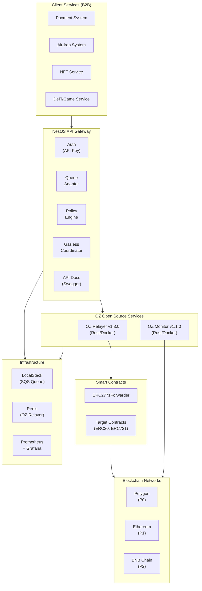
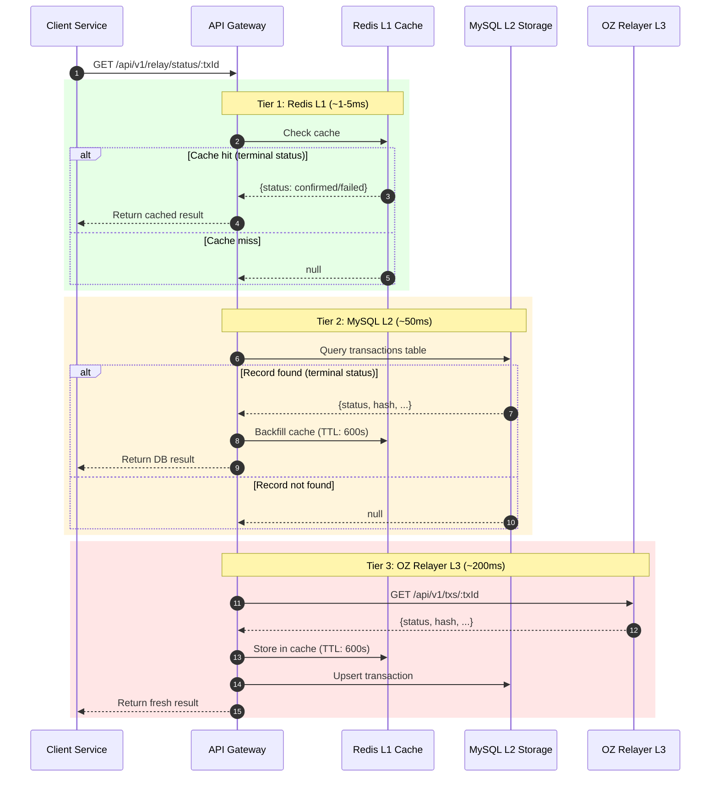
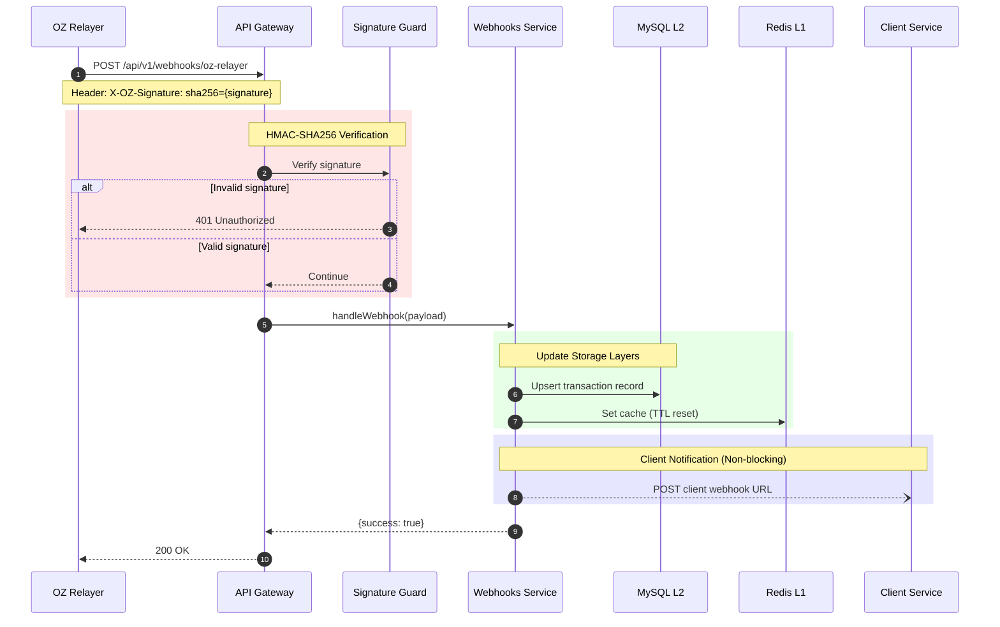

# MSQ Relayer Service - Structure Document

## Document Information
- **Version**: 12.4
- **Last Updated**: 2026-01-02
- **Status**: Phase 2 Complete (Phase 1 + TX History + 3-Tier Lookup + Webhook Handler)

### Related Documents
- [Product Requirements](./product.md)
- [Technical Stack and API Spec](./tech.md)
- [Task Master PRD](../.taskmaster/docs/prd.txt)
- [SPEC-PROXY-001](../.moai/specs/SPEC-PROXY-001/spec.md) - Nginx Load Balancer Architecture

---

## Project Structure Overview

MSQ Relayer Service is a **B2B Infrastructure** that enables internal Client Services (Payment, Airdrop, NFT services, etc.) to easily process blockchain transactions.

It utilizes **OZ open-source (Relayer + Monitor)** as its core, with NestJS API Gateway handling authentication/policy/quota management.

### Implementation Scope

| Phase | Scope | Status |
|-------|-------|--------|
| **Phase 1** | OZ Relayer + Redis, Auth, Health, Direct TX, Gasless TX, ERC2771Forwarder, EIP-712 verification, Nonce API, Multi-Relayer Pool | **Complete** |
| **Phase 2** | TX History (MySQL), Webhook Handler, 3-Tier Lookup, Redis L1 Cache, MySQL L2 Storage, Client Notifications | **Complete** |
| **Phase 3+** | Queue System (AWS SQS + LocalStack), OZ Monitor, Policy Engine, Kubernetes | Planned |

---

## 1. System Architecture

### 1.1 High-Level Architecture (v4.0 B2B Infrastructure)

```
┌─────────────────────────────────────────────────────────────────┐
│                    Client Services (B2B)                         │
│  ┌───────────┐ ┌───────────┐ ┌───────────┐ ┌───────────────┐   │
│  │ Payment   │ │ Airdrop   │ │ NFT       │ │ DeFi/Game     │   │
│  │ System    │ │ System    │ │ Service   │ │ Service       │   │
│  └───────────┘ └───────────┘ └───────────┘ └───────────────┘   │
└─────────────────────────────────┬───────────────────────────────┘
                                  │
                                  ▼
┌─────────────────────────────────────────────────────────────────┐
│                   NestJS API Gateway (Custom Development)        │
│  ┌───────────┐ ┌───────────┐ ┌───────────┐                     │
│  │ Auth      │ │ Queue     │ │ Policy    │                     │
│  │ (API Key) │ │ Adapter   │ │ Engine    │                     │
│  └───────────┘ └───────────┘ └───────────┘                     │
│  ┌───────────┐ ┌───────────────────────────────────────────┐   │
│  │ Gasless   │ │ API Documentation                         │   │
│  │Coordinator│ │ (Swagger/OpenAPI)                         │   │
│  └───────────┘ └───────────────────────────────────────────┘   │
└─────────────────────────────────┬───────────────────────────────┘
                                  │
          ┌───────────────────────┼───────────────────────┐
          │                       │                       │
          ▼                       ▼                       ▼
┌──────────────────┐ ┌─────────────────┐   ┌─────────────────┐
│  Nginx LB        │ │  OZ Monitor     │   │ Smart Contracts │
│  (Port 8080)     │ │  v1.1.0 (Rust)  │   │ (Solidity)      │
│  ──────────────  │ │  ─────────────  │   │ ─────────────   │
│ • ip_hash        │ │  • Block Watch  │   │ • ERC2771       │
│ • Round-robin    │ │  • Event Filter │   │   Forwarder     │
│ • Health check   │ │  • Balance Alert│   │ • Sample ERC20  │
│ • Failover       │ │  • Slack/Discord│   │ • Sample ERC721 │
│ • Access logging │ │  • Custom Script│   │                 │
│                  │ │                 │   │                 │
│ ┌──────────────┐ │ └────────┬────────┘   └─────────────────┘
│ │ OZ Relayer 1 │ │
│ │ (Port 8081)  │ │
│ └──────────────┘ │
│ ┌──────────────┐ │
│ │ OZ Relayer 2 │ │
│ │ (Port 8082)  │ │
│ └──────────────┘ │
│ ┌──────────────┐ │
│ │ OZ Relayer 3 │ │
│ │ (Port 8083)  │ │
│ └──────────────┘ │
└──────────────────┘
         │                     │
         └──────────┬──────────┘
                    ▼
┌─────────────────────────────────────────────────────────────────┐
│                      Infrastructure                              │
│  ┌───────────┐ ┌───────────┐ ┌───────────┐                     │
│  │ LocalStack│ │ Redis     │ │ Prometheus│                     │
│  │ (SQS)     │ │ (Relayer) │ │ + Grafana │                     │
│  └───────────┘ └───────────┘ └───────────┘                     │
└─────────────────────────────────────────────────────────────────┘
                    │
                    ▼
┌─────────────────────────────────────────────────────────────────┐
│                    Blockchain Networks                           │
│  ┌───────────┐ ┌───────────┐ ┌───────────┐                     │
│  │ Polygon   │ │ Ethereum  │ │ BNB Chain │                     │
│  │ (P0)      │ │ (P1)      │ │ (P2)      │                     │
│  └───────────┘ └───────────┘ └───────────┘                     │
└─────────────────────────────────────────────────────────────────┘
```

#### Mermaid Architecture Diagram



### 1.2 OZ Service Role Separation

| Component | Role | Implementation | Phase |
|-----------|------|----------------|-------|
| **OZ Relayer** | TX relay, Nonce/Gas/Retry (Single Instance - Phase 1) | Docker image (config only) | Phase 1 |
| **OZ Monitor** | Event detection, Balance alerts | Docker image (config only) | Phase 2+ |
| **NestJS Gateway** | Auth, Health, Direct TX, Gasless TX, EIP-712 verification, Nonce query | Custom development | Phase 1 (Production) |
| **ERC2771Forwarder** | Meta-TX Forwarder, Nonce management | OZ Contracts deployment | Phase 1 |

### 1.3 Multi-Relayer Pool Architecture

**Relayer Pool Approach**: Each Relayer holds an independent Private Key for parallel processing without Nonce collisions

```
┌─────────────────────────────────────────────────────────────┐
│                NestJS API Gateway                            │
│  ┌───────────┐ ┌───────────────┐ ┌─────────────────────┐   │
│  │ Auth      │ │ Queue         │ │ Pool Health         │   │
│  │ Module    │ │ Service (SQS) │ │ Monitor             │   │
│  └───────────┘ └───────────────┘ └─────────────────────┘   │
└─────────────────────────┬───────────────────────────────────┘
                          │
                          ▼
┌─────────────────────────────────────────────────────────────┐
│                Nginx Load Balancer                           │
│  ┌─────────────────────────────────────────────────────┐   │
│  │  upstream oz-relayers { least_conn; }                │   │
│  └─────────────────────────────────────────────────────┘   │
└─────────────────────────┬───────────────────────────────────┘
                          │ Routing Strategy: Least Connections
          ┌───────────────┼───────────────┐
          ▼               ▼               ▼
┌─────────────────┐ ┌─────────────────┐ ┌─────────────────┐
│ OZ Relayer #1   │ │ OZ Relayer #2   │ │ OZ Relayer #3   │
│ ─────────────── │ │ ─────────────── │ │ ─────────────── │
│ Key: 0xAAA...   │ │ Key: 0xBBB...   │ │ Key: 0xCCC...   │
│ Port: 8081      │ │ Port: 8082      │ │ Port: 8083      │
│ Status: Active  │ │ Status: Active  │ │ Status: Active  │
└────────┬────────┘ └────────┬────────┘ └────────┬────────┘
         │                   │                   │
         └───────────────────┴───────────────────┘
                             │
                             ▼
                    ┌─────────────────┐
                    │     Redis       │
                    │ (OZ Relayer     │
                    │  Internal Queue)│
                    └─────────────────┘
```

**Pool Management Features**:
| Feature | Description | Phase |
|---------|-------------|-------|
| Relayer Registry | Pool Relayer list management | Phase 1 |
| Health Check | Individual Relayer status monitoring | Phase 1 |
| Load Balancing | Round Robin / Least Load routing | Phase 1 |
| Manual Scaling | Manual Relayer add/remove | Phase 1 |
| Auto Scaling | Queue Depth based auto-scaling | Phase 2+ |

**Scaling Strategy**:
- **Phase 1**: Start with 1, manually scale (up to N)
- **Phase 2+**: Kubernetes HPA or Queue Depth based auto-scaling

### 1.4 Unified Request Flow

```
┌──────────────────────────────────────────────────────────────┐
│                        API Layer                              │
├──────────────┬──────────────┬─────────────┬─────────────────┤
│ POST         │ POST         │ GET         │ GET             │
│ /relay/direct│ /relay/gasless│ /relay/nonce│ /relay/status   │
└──────┬───────┴──────┬───────┴──────┬──────┴────────┬────────┘
       │              │              │               │
       ▼              ▼              │               │
┌──────────────┐ ┌───────────────────┴───────────────┴────────┐
│ Direct Path  │ │           Gasless Middleware               │
├──────────────┤ ├────────────────────────────────────────────┤
│ Whitelist    │ │ 1. Signature Verifier (EIP-712 pre-verify) │
│ validation   │ │ 2. Policy Engine (Contract/Method limits)  │
│ (NestJS)     │ │                                            │
└──────┬───────┘ │ 4. Forwarder TX Builder                    │
       │         └────────────────────┬───────────────────────┘
       │                              │
       └──────────────┬───────────────┘
                      ▼
┌─────────────────────────────────────────────────────────────┐
│                 OZ Relayer (v1.3.0 Rust)                     │
├─────────────┬─────────────┬─────────────┬───────────────────┤
│ Nonce       │ Gas         │ Signer      │ Queue             │
│ Manager     │ Estimator   │ Service     │ (Redis)           │
├─────────────┴─────────────┴─────────────┴───────────────────┤
│                    Retry Handler (Built-in)                  │
├─────────────────────────────────────────────────────────────┤
│                 Transaction Submitter                        │
└─────────────────────────────────────────────────────────────┘
```

---

## 2. Security Control Layer

Following OpenZeppelin official recommendations, security controls such as Contract/Method Whitelist are implemented in the **NestJS API Gateway**.

```
Request → [API Key Auth] → [Contract Whitelist] → [Method Whitelist]
                                                    ↓
                                            [User Blacklist]
                                                    ↓
         [EIP-712 Signature Pre-verify] → OZ Relayer → [Forwarder.execute()]
         (NestJS)                        (Rust)        (On-chain)
                                                    ↓
         OZ Forwarder: [EIP-712 Verify] → [Nonce Mgmt] → [Deadline Verify]
                       (On-chain)        (On-chain)      (On-chain)
```

---

## 3. Directory Structure (v5.0 - SPEC-INFRA-001 Standard)

```
msq-relayer-service/
├── docker/                          # Docker files directory
│   ├── Dockerfile.packages          # Multi-stage build (relay-api tsx execution)
│   ├── docker-compose.yaml          # Main config (includes Hardhat Node)
│   ├── docker-compose-amoy.yaml     # Polygon Amoy Testnet config
│   ├── config/
│   │   └── oz-relayer/              # OZ Relayer config files
│   │       ├── relayer-1.json       # Relayer #1 config
│   │       ├── relayer-2.json       # Relayer #2 config
│   │       └── relayer-3.json       # Relayer #3 config
│   ├── keys-example/                # Sample keystore (Git included, Hardhat #10,11,12)
│   │   ├── relayer-1/keystore.json
│   │   ├── relayer-2/keystore.json
│   │   └── relayer-3/keystore.json
│   └── keys/                        # Actual keystore (.gitignore)
│       ├── relayer-1/keystore.json
│       ├── relayer-2/keystore.json
│       └── relayer-3/keystore.json
│
├── scripts/
│   ├── health-check.sh              # Health check script
│   ├── test-infra.sh                # Integration test script
│   └── create-keystore.js           # Keystore creation script (ethers.js)
│
├── packages/
│   ├── relay-api/                 # NestJS API Gateway (Custom development)
│   │   ├── src/
│   │   │   ├── auth/                # API Key authentication module
│   │   │   │   ├── auth.module.ts
│   │   │   │   ├── auth.guard.ts
│   │   │   │   └── api-key.service.ts
│   │   │   │
│   │   │   ├── relay/               # Relay endpoints
│   │   │   │   ├── relay.module.ts
│   │   │   │   ├── direct/          # Direct TX controller
│   │   │   │   │   ├── direct.controller.ts
│   │   │   │   │   └── direct.service.ts
│   │   │   │   ├── gasless/         # Gasless TX controller
│   │   │   │   │   ├── gasless.controller.ts
│   │   │   │   │   └── gasless.service.ts
│   │   │   │   └── status/          # Status query (3-Tier Lookup)
│   │   │   │       ├── status.controller.ts
│   │   │   │       └── status.service.ts    # Redis L1 + MySQL L2 + OZ Relayer L3
│   │   │   │
│   │   │   ├── redis/               # Redis L1 Cache (Phase 2)
│   │   │   │   ├── redis.module.ts          # ioredis provider
│   │   │   │   └── redis.service.ts         # Cache operations
│   │   │   │
│   │   │   ├── prisma/              # MySQL L2 Storage (Phase 2)
│   │   │   │   ├── prisma.module.ts         # Global Prisma module
│   │   │   │   └── prisma.service.ts        # Database operations
│   │   │   │
│   │   │   ├── webhooks/            # OZ Relayer Webhook handler (Phase 2)
│   │   │   │   ├── guards/
│   │   │   │   │   └── webhook-signature.guard.ts  # HMAC-SHA256 verification
│   │   │   │   ├── webhooks.module.ts
│   │   │   │   ├── webhooks.controller.ts   # POST /webhooks/oz-relayer
│   │   │   │   ├── webhooks.service.ts      # Webhook processing
│   │   │   │   └── notification.service.ts  # Client notifications
│   │   │   │
│   │   │   ├── policy/              # Policy Engine (Phase 3+)
│   │   │   │   ├── policy.module.ts
│   │   │   │   ├── whitelist.service.ts
│   │   │   │   ├── blacklist.service.ts
│   │   │   │   └── rules.service.ts
│   │   │   │
│   │   │   ├── oz-relayer/          # OZ Relayer SDK wrapper
│   │   │   │   ├── oz-relayer.module.ts
│   │   │   │   └── oz-relayer.service.ts
│   │   │   │
│   │   │   ├── common/              # Shared utilities
│   │   │   │   ├── filters/
│   │   │   │   ├── interceptors/
│   │   │   │   └── decorators/
│   │   │   │
│   │   │   └── main.ts
│   │   │
│   │   ├── prisma/                  # DB schema (Phase 2+)
│   │   │   └── schema.prisma
│   │   │
│   │   └── package.json             # (No Dockerfile - uses docker/Dockerfile.packages)
│   │
│   ├── contracts/                   # Smart Contracts (using OZ) - SPEC-CONTRACTS-001
│   │   ├── contracts/
│   │   │   ├── forwarder/           # ERC2771Forwarder (OZ standard)
│   │   │   └── samples/
│   │   │       ├── SampleToken.sol  # ERC20 + ERC2771Context
│   │   │       └── SampleNFT.sol    # ERC721 + ERC2771Context
│   │   ├── scripts/
│   │   │   ├── deploy-forwarder.ts
│   │   │   └── deploy-samples.ts
│   │   ├── test/
│   │   │   ├── forwarder.test.ts
│   │   │   ├── sample-token.test.ts
│   │   │   └── sample-nft.test.ts
│   │   ├── deployments/
│   │   │   ├── localhost/
│   │   │   │   ├── forwarder.json
│   │   │   │   ├── sample-token.json
│   │   │   │   └── sample-nft.json
│   │   │   └── amoy/
│   │   │       └── forwarder.json
│   │   ├── hardhat.config.ts
│   │   └── package.json
│   │
│   └── examples/                    # Integration examples
│       ├── src/
│       │   ├── direct-tx/           # Direct Transaction examples
│       │   ├── gasless-tx/          # Gasless Transaction examples
│       │   └── contracts/           # Smart contract deployment examples
│       ├── README.md
│       └── package.json
│
├── k8s/                             # Kubernetes Manifests (Phase 2+)
│   ├── base/                        # Base manifests
│   └── overlays/
│       ├── staging/                 # Staging environment
│       └── production/              # Production environment
│
├── README.md                        # Project README (Documentation index)
│
└── docs/                            # Documentation
    ├── product.md                   # Product requirements (WHAT/WHY)
    ├── structure.md                 # This file (WHERE)
    └── tech.md                      # Technical spec (HOW)
```

### Docker Execution

```bash
# Hardhat Node (Local development environment)
cd docker && docker-compose up

# Polygon Amoy Testnet
cd docker && docker-compose -f docker-compose-amoy.yaml up
```

### Environment Variable Strategy

- **No .env file**: All environment variables specified directly in docker-compose.yaml
- **Network-specific config separation**: Hardhat (default) / Amoy (testnet)

---

## 4. Module Responsibility Separation (v3.0)

### 4.1 OZ Relayer (Config Only)

**OZ Relayer v1.3.0** - Transaction relay core engine (Rust, Docker)

| Feature | Description | Implementation Location |
|---------|-------------|------------------------|
| TX Relay | Transaction relay and signing | OZ Relayer built-in |
| Nonce Management | Automatic nonce management | OZ Relayer built-in |
| Gas Estimation | Gas estimation and adjustment | OZ Relayer built-in |
| Retry Logic | Retry logic | OZ Relayer built-in |
| Webhook | Status notifications | OZ Relayer built-in |

**Config file**: `config/oz-relayer/config.json`

### 4.2 OZ Monitor (Config Only) - Phase 2+

**OZ Monitor v1.1.0** - Blockchain event monitoring (Rust, Docker)

> Planned for Phase 2+ (Balance monitoring, Event alerts)

| Feature | Description | Implementation Location |
|---------|-------------|------------------------|
| Block Watch | Blockchain block monitoring | OZ Monitor built-in |
| Event Filter | Event filtering | OZ Monitor built-in |
| Balance Alert | Balance alerts | OZ Monitor built-in |
| Slack/Discord | Notification channel integration | OZ Monitor built-in |
| Custom Script | Python/JS/Bash scripts | OZ Monitor built-in |

**Config files**: `config/oz-monitor/networks/`, `monitors/`, `triggers/`

### 4.3 packages/relay-api (Custom Development)

**NestJS API Gateway** - Authentication, Policy, Quota, OZ Relayer proxy

| Module | Responsibility | Phase | Status |
|--------|---------------|-------|--------|
| `auth/` | API Key authentication | Phase 1 | Complete |
| `relay/direct/` | Direct TX endpoint, OZ Relayer proxy | Phase 1 | Complete |
| `relay/gasless/` | Gasless TX endpoint, EIP-712 pre-verification | Phase 1 | Complete |
| `relay/status/` | Transaction status query with 3-Tier Lookup | Phase 2 | Complete |
| `redis/` | L1 Cache - Transaction status caching (ioredis) | Phase 2 | Complete |
| `prisma/` | L2 Storage - MySQL persistence (Prisma ORM) | Phase 2 | Complete |
| `webhooks/` | OZ Relayer Webhook handler, TX History storage | Phase 2 | Complete |
| `policy/` | Contract/Method Whitelist, User Blacklist | Phase 3+ | - |
| `oz-relayer/` | OZ Relayer SDK wrapper service | Phase 1 | Complete |

#### 4.3.1 Auth Module Details (Phase 1)

**Authentication Method**:
- Single environment variable `RELAY_API_KEY` for API Key management
- Header: `X-API-Key: {api_key}`
- Verification by matching with environment variable value

```
packages/relay-api/src/auth/
├── auth.module.ts              # Global Guard registration
├── guards/
│   └── api-key.guard.ts        # X-API-Key verification
└── decorators/
    └── public.decorator.ts     # @Public() (Exception for Health Check, etc.)
```

**Docker Compose Environment Variables**:
```yaml
relay-api:
  environment:
    RELAY_API_KEY: "msq-dev-api-key-12345"
```

**Phase 2+ Extension**: Multiple clients, DB-based storage, Key rotation

#### 4.3.2 Gasless Module Details (Phase 1 - SPEC-GASLESS-001)

**Purpose**: Gasless Transaction API with EIP-712 signature verification and nonce management

**Architecture**:
```
packages/relay-api/src/relay/gasless/
├── dto/
│   ├── forward-request.dto.ts        # EIP-712 ForwardRequest structure (7 fields)
│   ├── gasless-tx-request.dto.ts     # API request: request + signature
│   └── gasless-tx-response.dto.ts    # API response: txId + status + timestamp
├── gasless.controller.ts              # Endpoints: POST /gasless, GET /nonce/:address
├── gasless.service.ts                 # Orchestration & nonce management
├── gasless.module.ts                  # NestJS module registration
├── signature-verifier.service.ts      # EIP-712 verification (ethers.js v6)
├── gasless.controller.spec.ts         # Controller tests (5 cases)
├── gasless.service.spec.ts            # Service tests (8 cases)
└── signature-verifier.service.spec.ts # Signature verifier tests (7 cases)
```

**Key Components**:

| Component | Responsibility | Implementation |
|-----------|---|---|
| **SignatureVerifierService** | EIP-712 signature verification + deadline validation | ethers.js `verifyTypedData()` |
| **GaslessService** | Orchestration: nonce query → validation → signature check → TX build → submit | RPC eth_call + OzRelayerService |
| **GaslessController** | REST endpoints: POST /gasless + GET /nonce/:address | NestJS controller with DTO validation |
| **ForwardRequestDto** | EIP-712 message structure (7 fields including nonce) | class-validator decorators |

**API Endpoints**:

| Endpoint | Method | Purpose | Status Code |
|----------|--------|---------|-------------|
| `/api/v1/relay/gasless` | POST | Submit gasless transaction | 202/400/401/503 |
| `/api/v1/relay/gasless/nonce/:address` | GET | Query current nonce | 200/400/503 |

**Workflow** (7-step validation):
1. Validate deadline is in future (server time)
2. Query expected nonce from ERC2771Forwarder contract
3. Validate request.nonce == expected nonce (Layer 1 pre-check)
4. Verify EIP-712 signature with recovered address
5. Build ERC2771Forwarder.execute() transaction calldata
6. Submit to OZ Relayer via OzRelayerService
7. Return 202 Accepted with transactionId + status

**Security Features**:
- Two-layer nonce validation (relay-api pre-check + contract final validation)
- Deadline validation (prevents stale transaction execution)
- EIP-712 signature verification (prevents tampering)
- Signer address verification (prevents spoofing)

**Test Coverage**: ~20 test cases across 3 test files (≥90% coverage target)

**E2E Test Script**: `packages/relay-api/scripts/test-gasless.ts`
- Scenario 1: Nonce query API
- Scenario 2: Valid gasless transaction submission
- Scenario 3: Invalid signature detection
- Scenario 4: Expired deadline detection
- Scenario 5: Invalid address format handling

### 4.4 packages/contracts

**Smart Contracts** - Hardhat project with OpenZeppelin-based contracts (SPEC-CONTRACTS-001)

#### Project Structure

| Directory | Responsibility | Status |
|-----------|---|---|
| `contracts/forwarder/` | Uses @openzeppelin/contracts/metatx/ERC2771Forwarder.sol directly | ✅ Deployed |
| `contracts/samples/` | SampleToken (ERC20), SampleNFT (ERC721) with ERC2771Context | ✅ Implemented |
| `scripts/` | Deployment scripts for Forwarder and Sample contracts | ✅ Ready |
| `test/` | Unit tests for contracts (signature verification, context integration) | ✅ Complete |
| `deployments/` | Deployment artifacts and addresses (localhost, amoy) | ✅ Created |

#### File Responsibilities

| File | Responsibility | Notes |
|------|---|---|
| `SampleToken.sol` | ERC20 + ERC2771Context | Gasless token transfer example |
| `SampleNFT.sol` | ERC721 + ERC2771Context | Gasless NFT minting example |
| `deploy-forwarder.ts` | ERC2771Forwarder deployment | Network detection (localhost, amoy) |
| `deploy-samples.ts` | Sample contracts deployment | Localhost only (Chain ID: 31337) |
| `forwarder.test.ts` | ERC2771Forwarder unit tests | EIP-712 verification, nonce management |
| `sample-token.test.ts` | SampleToken integration tests | Gasless transfer, context verification |
| `sample-nft.test.ts` | SampleNFT integration tests | Gasless minting, context verification |

#### Deployment Artifacts

**File Locations**:
- `deployments/localhost/forwarder.json` - Forwarder deployment on Hardhat Node
- `deployments/localhost/sample-token.json` - SampleToken deployment on Hardhat Node
- `deployments/localhost/sample-nft.json` - SampleNFT deployment on Hardhat Node
- `deployments/amoy/forwarder.json` - Forwarder deployment on Polygon Amoy

**Artifact Contents** (Example):
```json
{
  "address": "0x...",
  "deployer": "0x...",
  "network": "localhost",
  "chainId": 31337,
  "transactionHash": "0x...",
  "blockNumber": 1,
  "timestamp": "2025-12-18T00:00:00Z",
  "name": "Relayer-Forwarder-localhost",
  "version": "1",
  "abi": [...]
}
```

#### Deployment Commands

```bash
# Deploy to Hardhat Node (localhost)
npx hardhat run scripts/deploy-forwarder.ts --network localhost
npx hardhat run scripts/deploy-samples.ts --network localhost

# Deploy to Polygon Amoy
npx hardhat run scripts/deploy-forwarder.ts --network amoy

# Run tests
npx hardhat test

# Verify contract on Polygonscan (Amoy)
npx hardhat verify --network amoy <CONTRACT_ADDRESS>
```

#### Related Specifications

See [tech.md - Section 4](./tech.md#4-smart-contracts-technical-stack) for detailed technical specifications and implementation details.

For requirements and acceptance criteria:
- **SPEC**: `.moai/specs/SPEC-CONTRACTS-001/spec.md`
- **Acceptance**: `.moai/specs/SPEC-CONTRACTS-001/acceptance.md`
- **Implementation Plan**: `.moai/specs/SPEC-CONTRACTS-001/plan.md`

### 4.5 packages/examples

**Examples Package** - API usage examples and integration examples

| Module | Responsibility |
|--------|---------------|
| `direct-tx/` | Direct Transaction examples |
| `gasless-tx/` | Gasless Transaction examples |
| `contracts/` | Smart contract deployment examples |
| `integration/` | React app, Node.js backend integration examples |

---

## 5. Data Flow

### 5.1 Direct Transaction Flow

```
1. Client → POST /api/v1/relay/direct
2. NestJS API Gateway:
   a. API Key authentication
   b. Whitelist verification
3. NestJS → OZ Relayer SDK → OZ Relayer (Rust)
4. OZ Relayer:
   a. Nonce acquisition (built-in)
   b. Gas estimation (built-in)
   c. Sign with Relayer PK (built-in)
   d. TX submission (built-in)
   e. Retry handling (built-in)
5. OZ Relayer → Blockchain
6. msg.sender = Relayer address
7. Client → GET /api/v1/relay/status/{txId} (Status polling)
```

#### Mermaid: Direct Transaction Flow


### 5.2 Gasless Transaction Flow (Phase 1)

```
1. End User: Sign with EIP-712 (Client Service's frontend)
2. Client Service → POST /api/v1/relay/gasless (Forward End User signature)
3. NestJS API Gateway:
   a. API Key authentication (Client Service auth)
   b. EIP-712 Signature pre-verification
   c. Contract Whitelist check
   d. Method Whitelist check
   e. User Blacklist check
   f. Forwarder TX build
4. NestJS → OZ Relayer SDK → OZ Relayer (Rust)
5. OZ Relayer:
   a. Nonce acquisition (built-in)
   b. Gas estimation (built-in)
   c. Sign TX with Relayer PK (built-in)
   d. TX submission: Forwarder.execute(request, signature)
6. OZ ERC2771Forwarder (on-chain):
   a. EIP-712 signature verification
   b. Nonce verification & increment
   c. Deadline verification
7. Forwarder → Target Contract: call(data)
8. Target Contract: _msgSender() = End User address
9. Client Service → GET /api/v1/relay/status/{txId} (Status polling)
```

#### Mermaid: Gasless Transaction Flow


### 5.3 3-Tier Lookup Flow (Phase 2)



### 5.4 Webhook Flow (Phase 2)



---

## 6. OZ Service Configuration

> See [tech.md - Section 11, 12](./tech.md#11-oz-relayer-configuration) for detailed OZ service configuration

### 6.1 Config File Locations

| Service | Config Path | Description |
|---------|-------------|-------------|
| **OZ Relayer** | `config/oz-relayer/config.json` | Relayer config (Network, Signer, Policies, Webhook) |
| **OZ Monitor** | `config/oz-monitor/networks/` | Network config (RPC URL, Chain ID) |
| **OZ Monitor** | `config/oz-monitor/monitors/` | Monitor config (Balance, Event conditions) |
| **OZ Monitor** | `config/oz-monitor/triggers/` | Trigger config (Slack, Discord, Webhook) |

### 6.2 Key Configuration Items

**OZ Relayer**:
- `signer.type`: `local` (Local keystore) or `aws_kms` (AWS KMS)
- `policies.gas_price_cap`: Maximum Gas Price (wei)
- `policies.min_balance`: Minimum Relayer balance (wei)
- `notifications`: Webhook URL configuration

**OZ Monitor**:
- `conditions.type`: `balance_threshold` (Balance), `event` (Event)
- `triggers`: Slack, Discord, Telegram, Webhook support

---

## 7. Environment-specific Deployment Configuration

| Config | Local | Staging | Production |
|--------|-------|---------|------------|
| OZ Relayer | Docker Container | Docker/K8s | EKS Pod |
| OZ Monitor | Docker Container | Docker/K8s | EKS Pod |
| API Gateway | Docker Container | Docker/K8s | EKS Pod |
| Blockchain | Hardhat Node | Amoy | Polygon Mainnet |
| Database | MySQL Container (Phase 2+) | AWS RDS | AWS RDS Multi-AZ |
| Redis | Container | ElastiCache | ElastiCache Cluster |
| Secrets | docker-compose.yaml | K8s Secret | AWS Secrets Manager |
| Key Management | Local Keystore | AWS KMS | AWS KMS |
| Monitoring | Prometheus Local | Prometheus | Prometheus + Grafana |
| Forwarder | Auto-deploy | Pre-deployed | Pre-deployed |

---

## 8. Docker Compose Configuration

> See [tech.md - Section 13](./tech.md#13-docker-compose-configuration-v30) for detailed Docker Compose configuration

**Docker File Locations**:
- Main config: `docker/docker-compose.yaml` (Hardhat Node local development)
- Amoy config: `docker/docker-compose-amoy.yaml` (Polygon Amoy testnet)
- Dockerfile: `docker/Dockerfile.packages` (Multi-stage build)

**Service Configuration Overview (Local Development)**:

| Service | Image | Port | Role |
|---------|-------|------|------|
| hardhat-node | Custom Build | 8545 | Local blockchain (Chain ID: 31337) |
| relay-api | docker/Dockerfile.packages | 3000 | NestJS API Gateway |
| oz-relayer-1~3 | openzeppelin-relayer:v1.3.0 | 8081-8083, 8091-8093 | TX relay (Multi-Relayer Pool) |
| oz-monitor | openzeppelin-monitor:v1.1.0 | - | Event monitoring (Phase 2+) |
| redis | redis:8.0-alpine | 6379 | OZ Relayer internal Queue (AOF persistence) |
| prometheus | prom/prometheus:v2.47.0 | 9090 | Metrics (Phase 2+) |
| grafana | grafana:10.2.0 | 3001 | Dashboard (Phase 2+) |

**Phase 1 Core Services**: hardhat-node, relay-api, oz-relayer-1~3, redis

**Multi-Relayer Pool Configuration Approach**:
- `deploy.replicas` not used: Each Relayer needs unique Private Key (Nonce collision prevention)
- **YAML Anchors pattern** used: Minimize duplication by reusing common configuration
- Phase 2+: Kubernetes StatefulSet for true Replica pattern implementation planned

---

## Related Documents

- **[Product Requirements](./product.md)** (WHAT/WHY)
  - [Section 3.1: Functional Requirements](./product.md#31-phase-1-direct-tx--gasless-tx--payment-system-integration) - Smart contracts requirements
  - [Section 6: Milestones](./product.md#6-milestones) - Week 3 completion status
- **[Technical Details](./tech.md)** (HOW)
  - [Section 4: Smart Contracts Technical Stack](./tech.md#4-smart-contracts-technical-stack) - Detailed technical specifications
- **[Docker Setup Guide](./DOCKER_SETUP.md)** - Docker and Hardhat configuration
- **[SPEC-CONTRACTS-001](../.moai/specs/SPEC-CONTRACTS-001/spec.md)** - Smart Contracts Specification
  - [Acceptance Criteria](../.moai/specs/SPEC-CONTRACTS-001/acceptance.md)
  - [Implementation Plan](../.moai/specs/SPEC-CONTRACTS-001/plan.md)

---

## HISTORY

| Version | Date | Changes |
|---------|------|---------|
| 12.4 | 2026-01-02 | SPEC-WEBHOOK-001 Phase 2 Complete - Updated Implementation Scope (Phase 2 complete), Added redis/, prisma/, webhooks/ modules to directory structure, Updated Module Responsibility table with Phase 2 modules, Updated status/ module description with 3-Tier Lookup |
| 12.3 | 2025-12-30 | Queue System architecture update - Updated Infrastructure diagram (LocalStack SQS + Redis for Relayer), Updated Multi-Relayer Pool Architecture with Nginx LB, Updated Mermaid diagrams, Changed status to Multi-Relayer Pool |
| 12.2 | 2025-12-22 | Phase 1 MVP Completion - Updated version to 12.2, Changed architecture status to Single OZ Relayer instance, Updated Section 1.2 OZ Service Role Separation with Phase 1 Single Instance note, Added Status column to Module Responsibility table (all Phase 1 modules marked Complete), Updated Implementation Scope with Phase 1/2+ separation |
| 12.1 | 2025-12-19 | SPEC-CONTRACTS-001 integration - Added packages/contracts structure to Section 3, Expanded Section 4.4 with deployment artifacts, test suites, and deployment commands, Updated related documents section with SPEC links and cross-references |
| 12.0 | 2025-12-15 | Document version sync - Complete document structure cleanup, Remove duplicates, Establish cross-reference system |
| 11.4 | 2025-12-15 | Document role clarification - Add related documents section (cross-references) |
| 11.3 | 2025-12-15 | Fix section number duplication - Change 1.3 Unified Request Flow to 1.4 (Resolve conflict with 1.3 Multi-Relayer Pool Architecture) |
| 11.2 | 2025-12-15 | Add Multi-Relayer Pool configuration approach explanation - YAML Anchors pattern usage reason, deploy.replicas not used reason (Individual Private Key required) |
| 11.1 | 2025-12-15 | Add Section 4.3.1 Auth Module Details - Phase 1 single environment variable method (RELAY_API_KEY), Module structure, Phase 2+ extension plan |
| 11.0 | 2025-12-15 | SPEC-INFRA-001 Docker structure sync - Consolidate to docker/ directory, Multi-stage build, Remove .env, Include Hardhat Node, Redis 8.0-alpine (AOF persistence), Named Volume (msq-relayer-redis-data), OZ Relayer RPC_URL environment variable, Read-only volumes |
| 10.0 | 2025-12-15 | Move MySQL/Prisma to Phase 2+ - Phase 1 uses OZ Relayer + Redis only, No DB |
| 9.0 | 2025-12-15 | Move TX History, Webhook Handler to Phase 2+ - Phase 1 uses status polling method, MySQL/Webhook in Phase 2+ |
| 8.0 | 2025-12-15 | Remove Rate Limiting, Quota Manager completely - Phase 1 keeps Auth + Relay features only, Policy/Quota Phase 2+ TBD |
| 7.0 | 2025-12-15 | Phase 2 redesign - Remove SDK (Replace with API docs), Add Queue System (QUEUE_PROVIDER pattern) |
| 6.2 | 2025-12-15 | Docker structure finalized - Package-specific Dockerfile approach adopted (packages/relay-api/Dockerfile), Add .dockerignore |
| 6.1 | 2025-12-15 | Add Multi-Relayer Pool architecture - Independent Private Key based parallel processing, Load Balancing (Round Robin/Least Load), Manual Scaling (Phase 1), Auto Scaling (Phase 2+) |
| 6.0 | 2025-12-15 | Include Gasless TX in Phase 1 - Move relay/gasless module to Phase 1, Add ERC2771Forwarder, Keep OZ Monitor/Policy/Quota in Phase 2+ |
| 5.0 | 2025-12-14 | Reorganize around Phase 1 - Add implementation scope table, Specify Phase per module, Mark OZ Monitor/Gasless as Phase 2+ |
| 4.0 | 2025-12-13 | Complete rewrite from B2B Infrastructure perspective - Client Services centric architecture, Add Client Service to Gasless Flow |
| 3.3 | 2025-12-13 | Deduplication (Docker/OZ config → refer to tech.md), Remove SDK Research document |
| 3.2 | 2025-12-13 | Add Mermaid diagrams (Architecture, Direct TX Flow, Gasless TX Flow) |
| 3.1 | 2025-12-13 | Move README.md to root, Update directory structure diagram |
| 3.0 | 2025-12-13 | Complete architecture redesign based on OZ open-source (Relayer v1.3.0, Monitor v1.1.0), Delegate Nonce/Gas/Retry modules to OZ |
| 2.3 | 2025-12-12 | Document consistency improvements, Remove SDK directory structure duplication |
| 2.2 | 2025-12-12 | Add packages/examples package |
| 2.1 | 2025-12-12 | Update packages/sdk to OZ Defender SDK compatible structure |
| 2.0 | 2025-12-12 | Initial structure.md creation |
